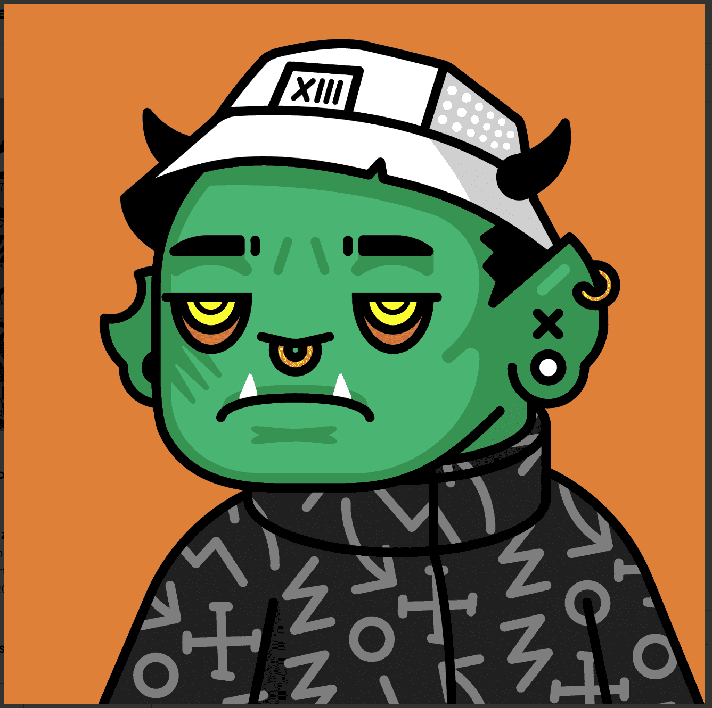

# DeadFellaz

Deadfellaz 感染 S1 NFT - 常见问题 (FAQ)
▶ 什么是 Deadfellaz 感染 S1？
Deadfellaz Infected S1 是一个 NFT（不可替代令牌）集合。存储在区块链上的数字艺术品集合。
▶ 存在多少 Deadfellaz Infected S1 代币？
总共有 186 个 Deadfellaz 感染的 S1 NFT。目前，156 位所有者的钱包中至少有一个 Deadfellaz Infected S1 NTF。
▶ Deadfellaz Infected S1 最昂贵的销售是什么？
出售的最昂贵的 Deadfellaz Infected S1 NFT 是 Infected Heroine #2。它于 2022 年 8 月 14 日（19 天前）以 130 美元的价格售出。
▶ 最近卖出了多少 Deadfellaz Infected S1？
过去 30 天内售出了 1 个 Deadfellaz Infected S1 NFT。
▶ 什么是流行的 Deadfellaz Infected S1 替代品？
许多拥有 Deadfellaz Infected S1 NFT 的用户还拥有 QuantumGenesis、3GO-8OUL、SLAM x ZION 和 Streets of Istanbul。

