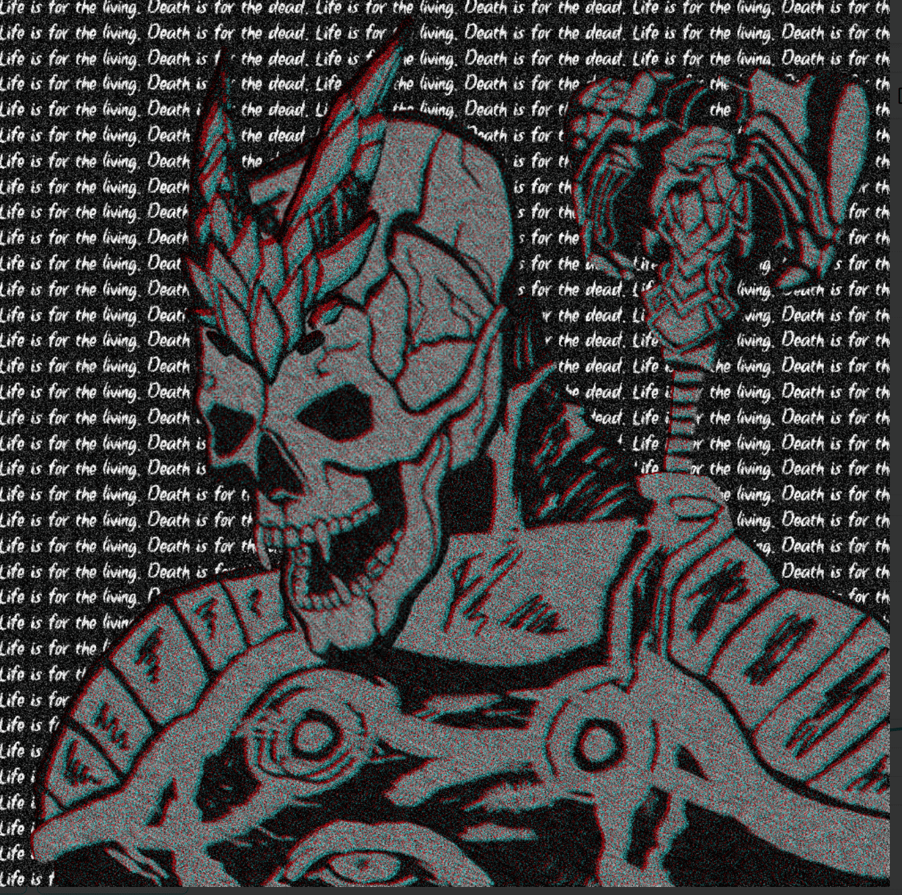

# death is inevitable NFT

死亡是不可避免的 NFT NFT - 常见问题（FAQ）
▶ 什么是死亡不可避免的 NFT？
死亡是不可避免的 NFT 是一个 NFT（不可替代的代币）集合。存储在区块链上的数字艺术品集合。
▶ NFT代币存在多少死亡是不可避免的？
总共有 3,666 个死亡是不可避免的 NFT NFT。目前 1,572 位所有者的钱包中至少有一个死亡是不可避免的 NFT NTF。
▶ 什么是最昂贵的死亡是不可避免的 NFT 销售？
最昂贵的死亡是不可避免的 NFT NFT 出售是死亡是不可避免的#1573。它于 2022-06-06（3 个月前）以 451.6 美元的价格售出。
▶ 最近卖出了多少死亡是不可避免的 NFT？
在过去的 30 天内，有 4,976 个 NFT 死亡是不可避免的。
▶ 死亡是不可避免的 NFT 成本是多少？
在过去的 30 天里，最便宜的 NFT 死亡不可避免 NFT 销售额低于 18 美元，最高销售额超过 73 美元。死亡的中位数价格是不可避免的 NFT NFT 在过去 30 天内为 42 美元。
▶ 什么是流行死亡不可避免的 NFT 替代品？
许多拥有死亡不可避免的 NFT NFT 用户也拥有 REV3AL REBORN、Goblin Bot、Leave Me Alone NFT 和 GODLY LEGION。

