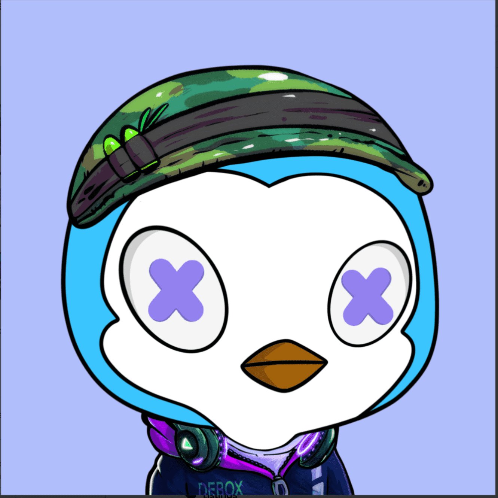

# DeBox Guardians Penguin

基于这些区块链DID，使持有代币的用户在未经许可的情况下加入相应的群组。

使用多维身份数据进行标记，以增加语音的可信度。让优质信息真实传递。群聊是所有 DAO 组织结构的起点。一切，包括提案、投票、财务、资本管理、交易、抽奖、合约工具，都在这里发生……

以去中心化的方式为 DAO 治理建立一个完整和开放的平台。成立 DeBox 基金会，鼓励更多开发者参与平台建设。

