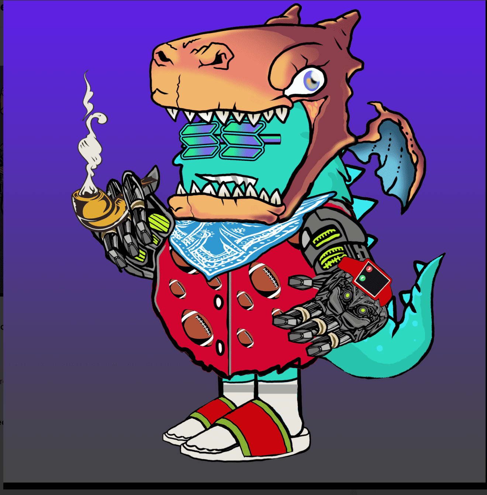

# Decentrabis

Decentrabis NFT - 常见问题（FAQ）
▶ 什么是 Decentrabis？我们的Decentrabis是最出色的。
Decentrabis 是一个 NFT（不可替代代币）集合。存储在区块链上的数字艺术品集合。
▶ 有多少 Decentrabis 代币？
总共有 4,199 个 Decentrabis NFT。目前，2,758 位车主的钱包中至少有一个 Decentrabis NTF。
▶ 最近卖出了多少 Decentrabis？
过去 30 天内售出 0 个 Decentrabis NFT。
▶ 什么是流行的 Decentrabis 替代品？
许多拥有 Decentrabis NFT 的用户还拥有 Pet Rock Collection、PROJECT 800 的 SAMURAI 800、LibertasSpectrum 和 ApeApeParty。过去 7 天没有出售任何 Decentrabis。

