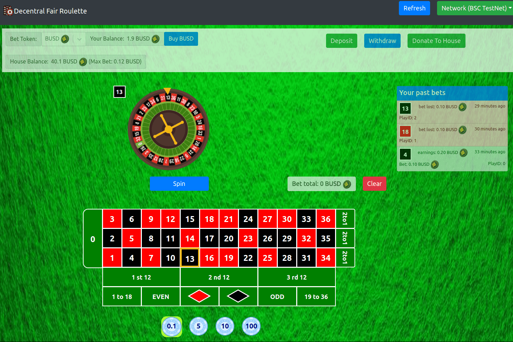

# Decentral Labs Roulette

轮盘赌公平游戏应用程序，接受美元和其他代币进行投注。完整的去中心化轮盘赌应用。所有游戏逻辑都在智能合约内。 Web UI 可以在 github 页面等静态页面上 100% 运行。*轮盘赌*公平游戏应用程序，接受美元和其他代币进行投注。完整的*去中心化轮盘赌*应用。所有游戏逻辑都在智能合约内。Web UI 可以 100% 运行在*Decentral Labs 轮盘赌*是一款公平竞争的轮盘赌游戏，可以用真实美元 (BUSD) 或代币 (OLK) 下注。所有游戏逻辑都在区块链上，UI 可以运行...*Decentral Labs 轮盘赌*、2022 年 8 月的优惠券和优惠。在*Decentral Labs 轮盘赌*中选择商品可享受 20% 的折扣，

