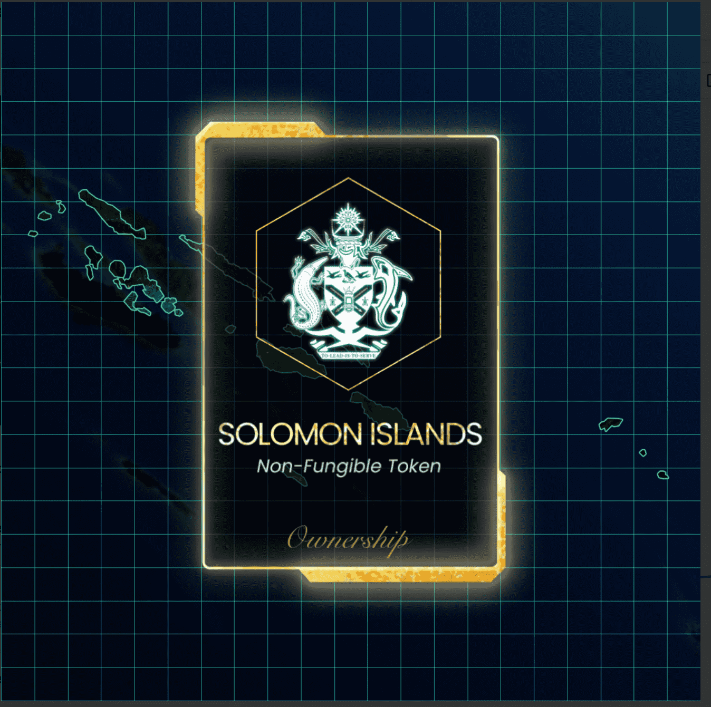

# DeNations

DeNations（去中心化国家）是一个区块链驱动的去中心化元宇宙，任何人都可以在其中建立和管理国家、城市和文明。

在 Play.DeNations.com 注册您的国家所有权 (NFT) 并享受税收农业！

DeNations 是一个与现实世界互动的虚拟元宇宙，其中的城市/州/文明会根据现实世界和 DeNations 的事件发生变化。

这些国家、城市和文明以以太坊 NFT 发行，并且 NFT 的数量将受到限制，因为国家或城市在现实世界中是有限的。

让您的国家/城市在 DeNations 中繁荣昌盛，并通过管理耕作获得象征性的利润。

