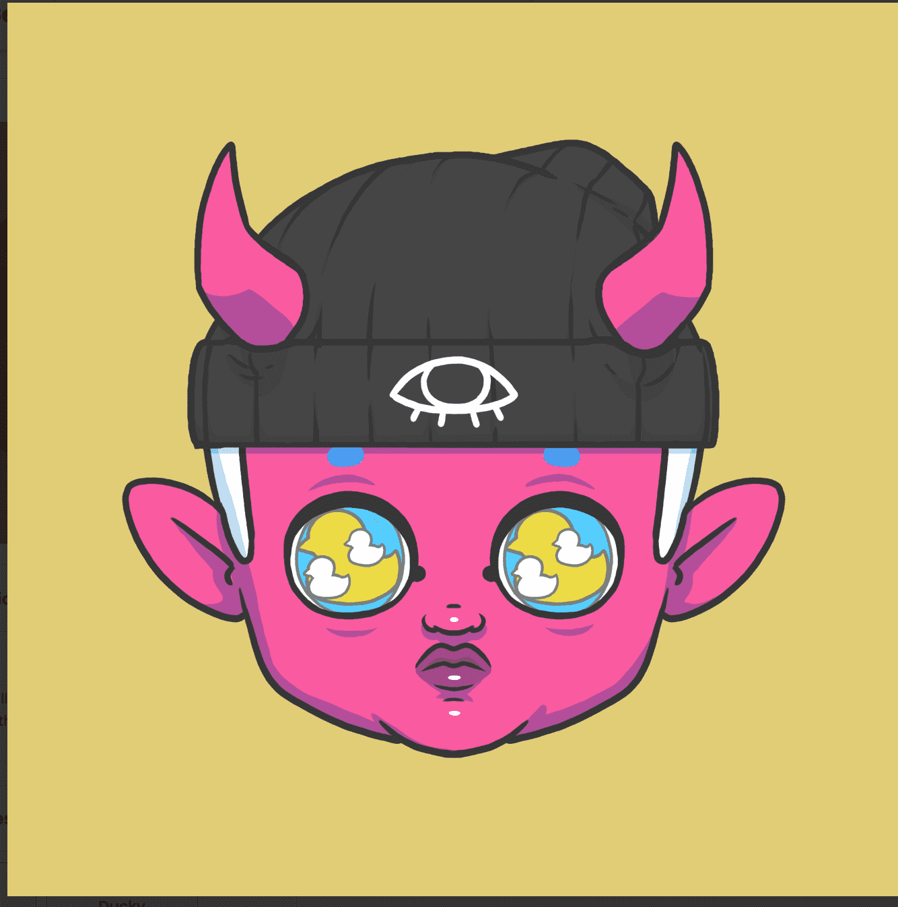

# Deebies

Witchy GF 是 7,890 个动画头像的集合，其中包含 800 多个独特特征，由插画家 Sketchnate 手绘，作为对 Deebies 生态系统的扩展。这些女巫来自 Interrobang 星球，那里有 28 种不同的魔法类型和一个可以探索的世界。它们旨在赋予世界各地的艺术家权力，并以与您的能量相匹配的特征激发您的灵感。出生在 Interrobang 星球上的 Heck 大火中，淘气的 Deebies 从地面上的一个裂开的洞中逃到了地表。一些蔓延到神秘的古庙，另一些蔓延到色彩鲜艳的乌比杜普森林，其余的则爬上了无处黑暗尖尖的山丘。

他们建造了临时避难所，现在生活在各种各样的生物的包围中，他们可以玩耍和骑车取乐。每个 Deebie 都想成为独一无二的，所以他们用不同的配饰装饰自己，有些甚至演变成其他 Deebie 没有的特征。

虽然 Deebies 足智多谋，但它们仍然是婴儿，需要有人爱和保护它们。采用 Deebie 不仅能让他们远离危险，还能让他们安全地进行试验。强烈鼓励为您采用的 Deebies 创建独特的衍生版本，并有助于填充这个新发现的领域。

