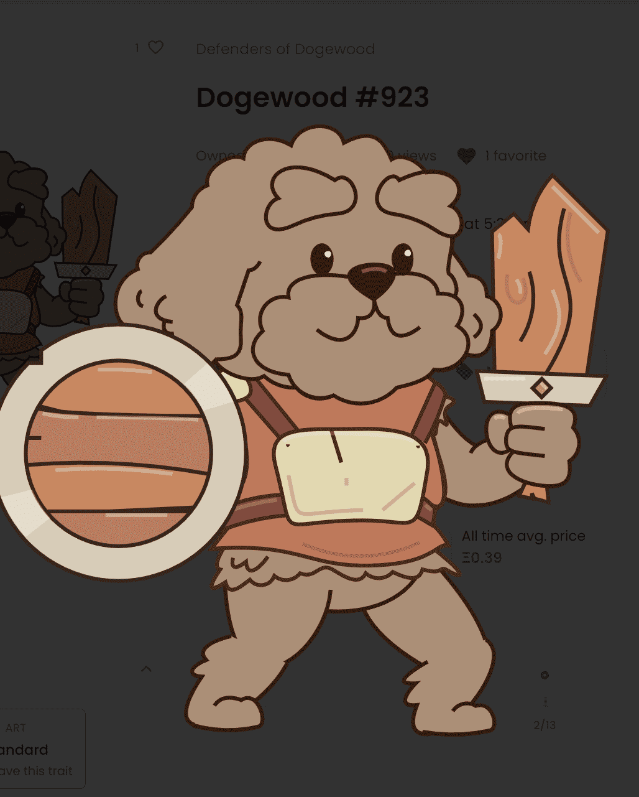

# Defenders of Dogewood

实际拥有者数量：截至 22 年 5 月 4 日，约 1160 个，其中 93% 以上的赌注在游戏中。

Dogewood 是一个 100% 发生在链上的角色扮演游戏——元数据和图像完全在链上生成和存储。Dogewood NFT 的捍卫者 - 常见问题 (FAQ)
▶ 什么是 Dogewood 的捍卫者？
Dogewood 的捍卫者是一个 NFT（非同质代币）集合。存储在区块链上的数字艺术品集合。
▶ Dogewood 代币的捍卫者有多少？
总共有 5,001 名 Dogewood NFT 的捍卫者。目前，238 位所有者的钱包中至少有一个 Dogewood NTF 捍卫者。
▶ 最昂贵的 Dogewood 捍卫者拍卖会是什么？
最昂贵的 Dogewood NFT 捍卫者是 Dogewood #2925。它于 2022-06-23（2 个月前）以 439.1 美元的价格售出。
▶ 最近卖出了多少道奇伍德的捍卫者？
过去 30 天内共售出 62 个 Dogewood NFT 捍卫者。
▶ Dogewood 的捍卫者需要多少钱？
在过去 30 天里，Dogewood NFT 最便宜的防御者销售额低于 27 美元，最高销售额超过 201 美元。过去 30 天 Dogewood NFT 捍卫者的中位价格为 44 美元。
▶ 什么是流行的 Dogewood 捍卫者替代品？
许多拥有 Dogewood NFT 捍卫者的用户还拥有 Puxxies、MGC NFT、Scallywags 和 PotatoPunks。

