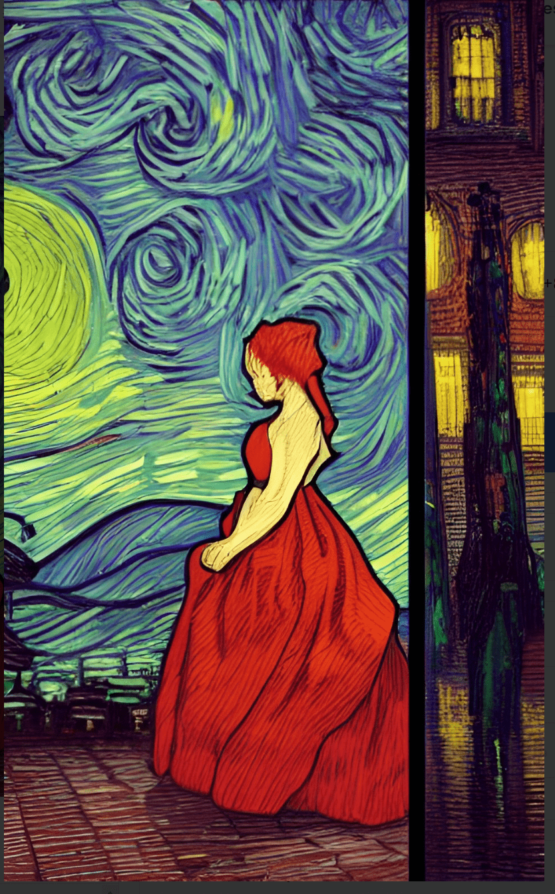

# defendWeb3

你读什么或听什么并不重要：现在，每个人都在谈论 Web3。但是，当您越过头条新闻时，就会发现一件了不起的事情：Web3 正在强化自己。我们正在清除不良行为者，并为我们所有人拥有的新互联网奠定基础。是时候回归基础并提醒自己我们为什么在这里了。您可信赖的、不起眼的钱包是您通往 Web3 的门户。但是我们生态系统中最大的钱包由 Web2 式的大型公司控制，我们开始意识到这对我们的权利和自由有可怕的影响。看看你的钱包，问问自己：“谁在监视我的活动？他们可以审查我、阻止我访问我的资产或指定我连接到哪些协议或网络吗？谁在这里发财了？”你会惊讶于你的发现。

Tally Ho 正在打造我们应得的钱包。
现在想象一个社区拥有的钱包，它实际上体现并保护了 Web3 的价值——一个可供地球上任何地方的任何人使用的钱包，它可以为自己融资，由 DAO 管理，对你负责，而不是对某个不露面的公司负责。嗯，这就是 Tally Ho：一个适合所有人的 Web3 钱包，旨在保护您的资产和权利。

