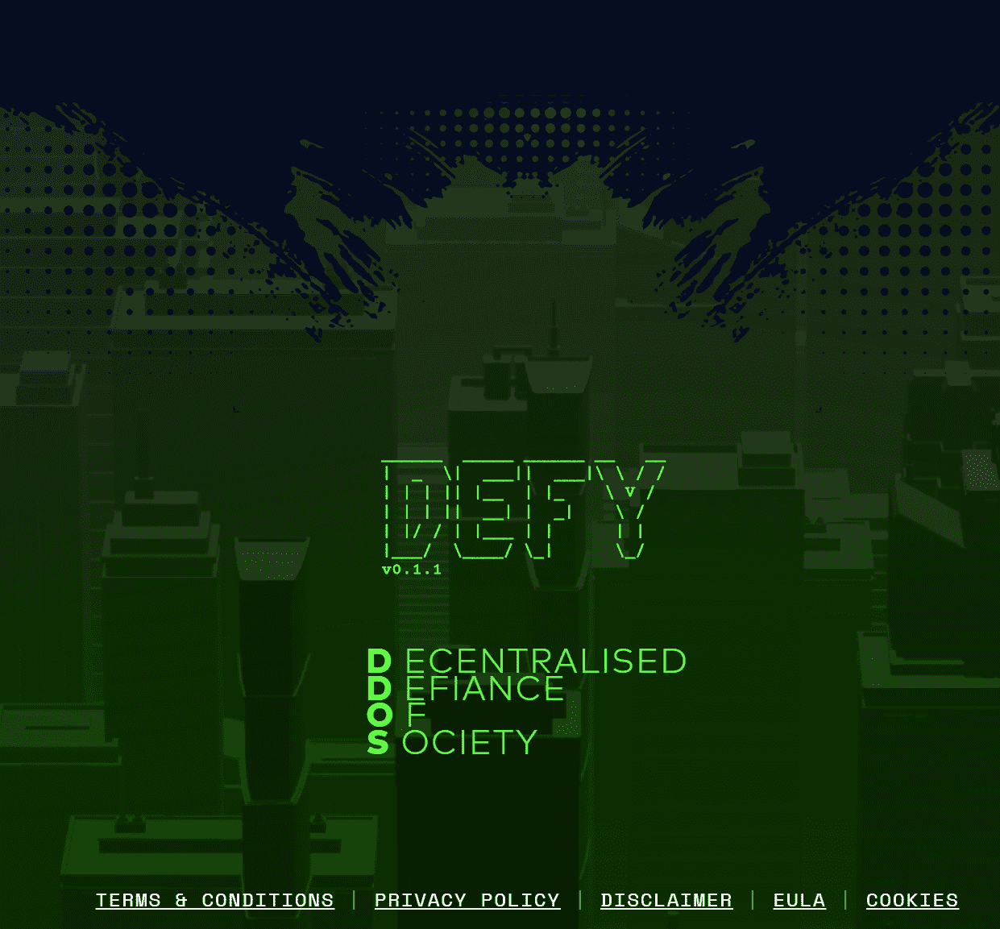

# DEFY Genesis Invites - Phase Two

合同暂停 - 第二阶段在 13 分钟内售罄。

一系列 NFT 邀请函让持有者有机会在 4 月 30 日的第二阶段铸造中铸造 8888 个 Genesis NFT 面具之一。在不久的将来的反乌托邦世界中，Future Systems 比我们想象的更快地积累了独裁者梦寐以求的力量。通过一系列不正当的收购，这家不知名的公司以免费提供给世界为幌子，获得了为互联网提供动力的全球网络的控制权。

隐私和个性是过去时代的遗物。我们依靠未来系统来提供政府过去控制的生活必需品——健康、教育和金钱。

