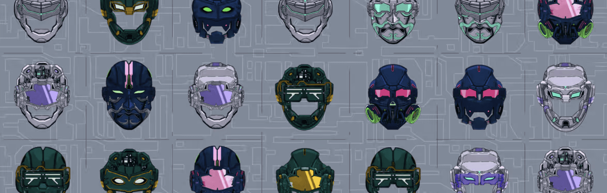

# DEFY Uprising Invites - Tier 1

**DEFY Genesis 邀请统计**

创建于 5 个月前，39,059 代币供应，5% 费用

32,326 名 Discord 成员

过去 7 天内没有出售任何 DEFY Genesis 邀请。

*合同暂停* 第一阶段铸币厂已关闭，第一阶段/幻影银河邀请不能用于第二阶段。

一系列 NFT 邀请，让持有者有机会*在可用性持续期间铸造 8888 个 Genesis NFT 面具之一*

DEFY Genesis 邀请 NFT - 常见问题 (FAQ)
▶ 什么是 DEFY Genesis 邀请？
DEFY Genesis Invites 是一个 NFT（非同质代币）集合。存储在区块链上的数字艺术品集合。
▶ 存在多少个 DEFY Genesis Invites 代币？
总共有 39,059 个 DEFY Genesis 邀请 NFT。目前，35,736 名所有者的钱包中至少有一个 DEFY Genesis Invites NTF。
▶ 最近卖出了多少 DEFY Genesis 邀请？
在过去 30 天内售出 0 个 DEFY Genesis Invites NFT。
▶ 什么是流行的 DEFY Genesis Invites 替代品？
许多拥有 DEFY Genesis Invites NFT 的用户还拥有 Miss PoP Art、 Ultraego Specialties、 META-ROID和 Unique Crypto Planets Cards。

