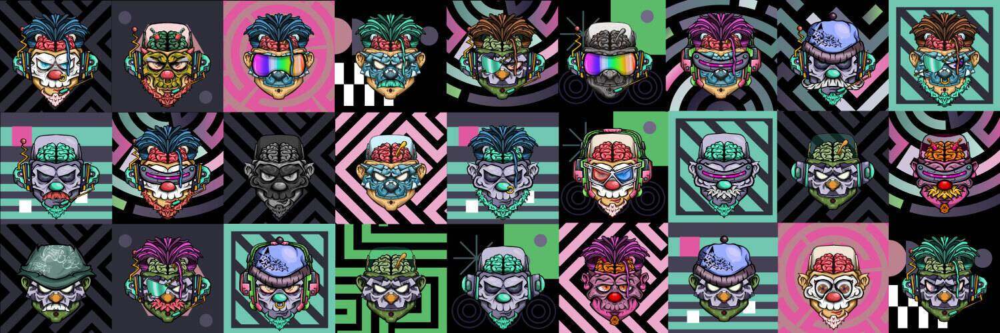

# DEFYS Genesis Mask

DEFY Genesis Masks NFT 在过去 7 天内售出 97 次。DEFY Genesis Masks 的总销售额为 18.72 万美元。一个 DEFY Genesis Masks NFT 的平均价格为 193 美元。有 4,856 名 DEFY Genesis Masks 所有者，总共拥有 8,727 个代币。

DEFY 设定在一个近未来的反乌托邦世界，一个不知名的公司 Future Systems 在运行互联网的全球网络上积累了独裁者级别的权力。结果，普通人群的成员不再有任何隐私或个性。

使用由名为 kha0s 的个人创建的 NFT 虚拟私有掩码 (VPM)，操作员可以隐藏他们的身份并通过被利用的移动应用程序侵入 Future Systems 网络。所有特工都需要虚拟私人面具（VPM）在开始游戏之前隐藏他们的身份。

