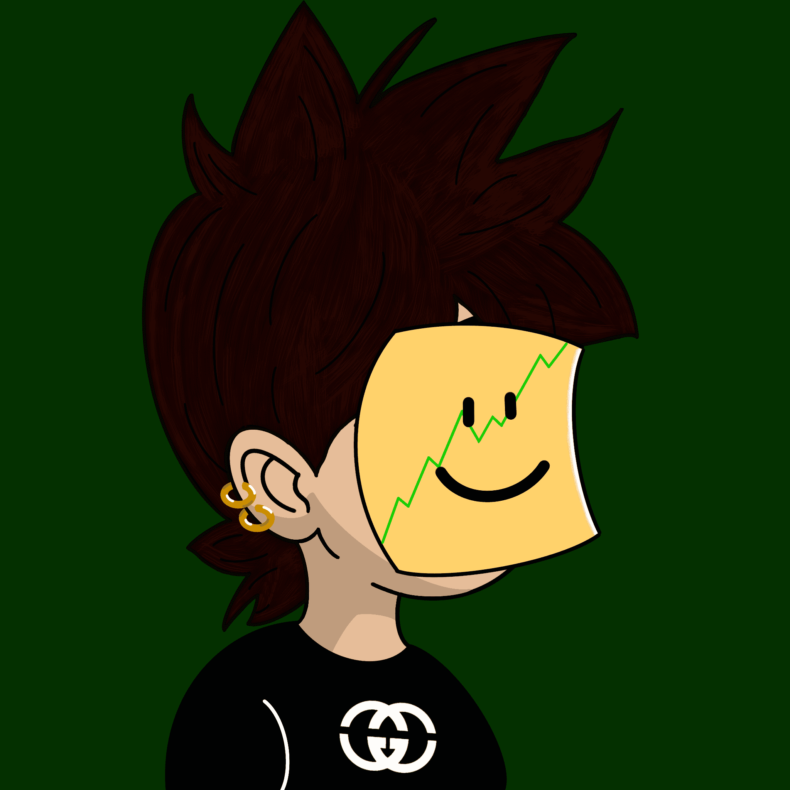

# Degen Avatars Genesis

**Degen Avatars OG统计**

创建于 2 个月前，327代币供应，10% 费用

Degen Avatars OG NFT 在过去 7 天内售出 2 次。Degen Avatars OG 的总销售额为 0 美元。一个 Degen Avatars OG NFT 的平均价格为 0 美元。Degen Avatars OG 拥有者 260 人，总供应量为 327 个。

Degen Avatars 即将加入连锁店，让您可以访问顶级召唤者、alpha 等等！

Degen Avatars OG NFT - 常见问题（FAQ）
▶ 什么是 Degen Avatars OG？
Degen Avatars OG 是一个 NFT（不可替代令牌）集合。存储在区块链上的数字艺术品集合。
▶ Degen Avatars OG 代币有多少？
总共有 327 个 Degen Avatars OG NFT。目前 260 位所有者的钱包中至少有一个 Degen Avatars OG NTF。
▶ Degen Avatars OG 最贵的促销是什么？
售出的最昂贵的 Degen Avatars OG NFT 是 Degen Avatars #222。它于 2022-06-19（2 个月前）以 28.8 美元的价格售出。
▶ Degen Avatars OG 最近卖出了多少？
过去 30 天内售出了 5 个 Degen Avatars OG NFT。

