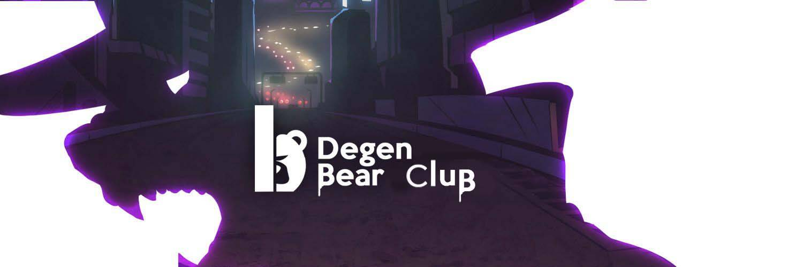

# Degen Bear Club

持有人：Degen Bear + Degen Bear GF = 免费小熊。如果您持有所有收藏中的 3 只熊：Bear Token (Site Soon)

Degen Bear Club 是 Nfs 的集合，售罄后，您可以访问由 DAO 提供支持的独家社区和佣金收入，旨在为持有者提供被动收入和独家访问权。设定你的价格，收集你的熊收藏，寻找稀有的，使用特征。接下来会发生什么？你很快就会看到

Degen Bear Club NFT - 常见问题（FAQ）
▶ 什么是德根熊俱乐部？
Degen Bear Club 是一个 NFT（非同质代币）集合。存储在区块链上的数字艺术品集合。
▶ 有多少 Degen Bear Club 代币？
总共有 2,500 个 Degen Bear Club NFT。目前，885 位车主的钱包中至少有一个 Degen Bear Club NTF。
▶ 最昂贵的 Degen Bear Club 销售是什么？
售出的最昂贵的 Degen Bear Club NFT 是 Degen Bear #18。它于 2022-06-10（3 个月前）以 18 美元的价格售出。
▶ Degen Bear Club 最近卖出了多少？
过去 30 天内售出了 33 个 Degen Bear Club NFT。
▶ Degen Bear Club 的费用是多少？
在过去 30 天里，最便宜的 Degen Bear Club NFT 销售额低于 5 美元，最高销售额超过 8 美元。过去 30 天内，Degen Bear Club NFT 的中位价格为 5 美元。
▶ 什么是流行的 Degen Bear Club 替代品？
许多拥有 Degen Bear Club NFT 的用户还拥有 The Cornz、 Back in the Apes、 BearsBulls Fight和 SunCity Ape Club。

