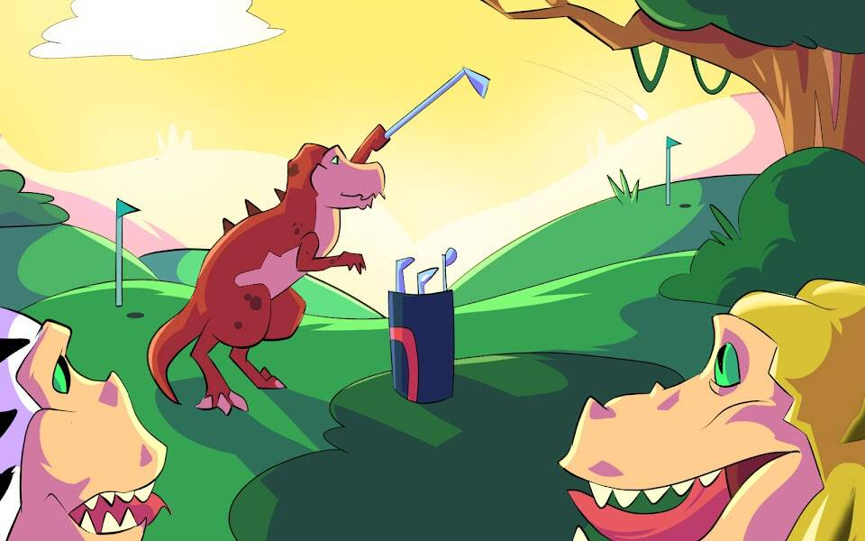

# Degen Dinos GC

Degen Dinos 是 5,555 个 Degenerate Dinosaur 1-1 NFT 的集合 - 生活在以太坊区块链上的独特数字收藏品。所有权包括您的 Degen Dino NFT 的创意和商业权利以及高尔夫俱乐部的邀请。社区可以通过激活路线图来解锁未来的福利。每个 Degen Dino 都是独一无二的，并通过 150 多种可能的特征以编程方式生成，包括身体、表情、头饰、服装等。所有的恐龙都是涂料，但有些比其他的更稀有。恐龙作为 ERC-721 令牌存储在以太坊区块链上并托管在 IPFS 上。

