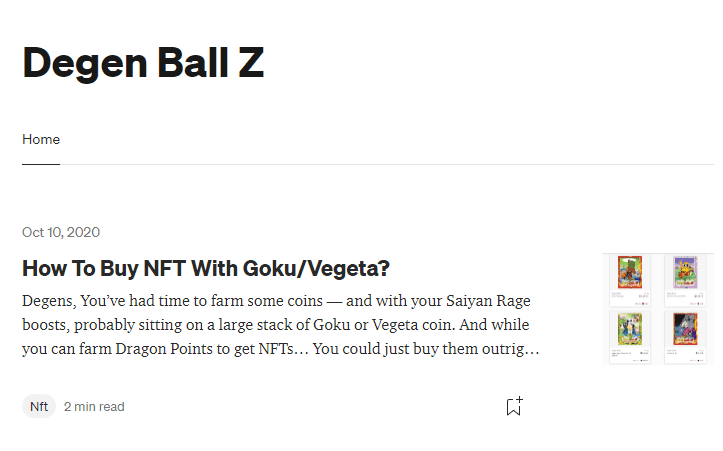

# DegenBallz

您已经有时间种植一些硬币 - 并且您的赛亚人愤怒提升，可能坐在一大堆悟空或贝吉塔硬币上。虽然你可以通过种植 Dragon Points 来获得 NFT……

自农场开业以来，已经过去了一天。

所以，当然，问题变成了：哪些农场的 APY 最高？但问题是——他们所有人的 APY 仍然疯狂地退化。又名——农场里还没有人。当你添加 Saiyan Rage 时……当 gas 超过 300 时，Powell 的打印看起来会比 eth 交易慢。APY 的长度超过 7 位数的原因是，现在实际上没有人在这些农场耕种 - 所以如果你是一个真正的网虫，现在就是你的机会。

