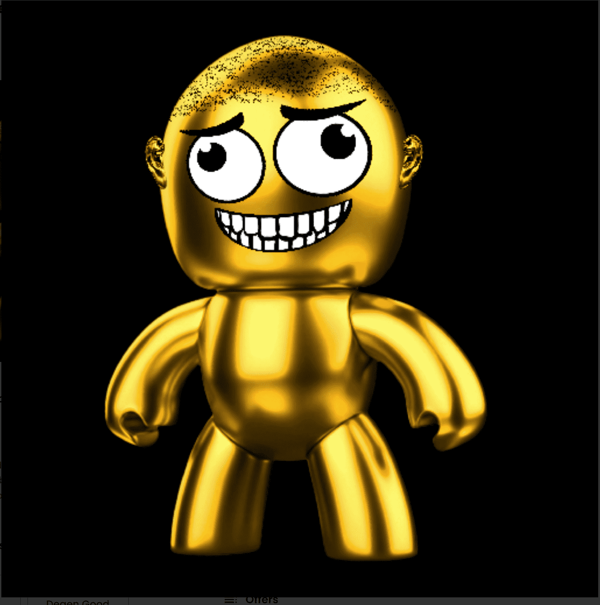

# DegenBox NFT

很快，乐趣就开始了。德根。感谢您的加入。DegenBox NFT NFT - 常见问题（FAQ）
▶ 什么是 DegenBox NFT？
DegenBox NFT 是一个 NFT（Non-fungible token）集合。存储在区块链上的数字艺术品集合。
▶ 有多少 DegenBox NFT 代币？
总共有 555 个 DegenBox NFT NFT。目前，308 位所有者的钱包中至少有一个 DegenBox NFT NTF。
▶ 最近卖出了多少 DegenBox NFT？
过去 30 天内售出 0 个 DegenBox NFT NFT。收集所有 5 个版本的 Degen Box。总计 555 条。 5 级稀有物品尚未公布。

打开里面你会发现什么都没有。

