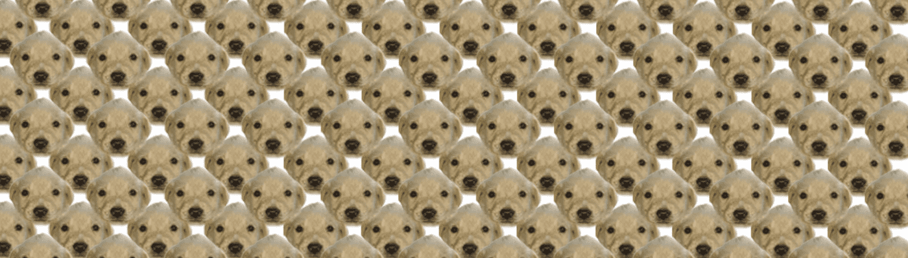

# DegenDoggos NFT

Degen Doggos 的使命是帮助世界各地的狗收容所和无家可归的狗
在提供乐趣、创意和
可爱的个人资料图片
nft 空间。
很大比例的薄荷销售和所有二级市场特许权使用费
注定要狗
乌克兰的避难所。

每只德根狗狗都会有
它自己的像素化版本
免费，并有机会购买您可定制的毛绒玩具。

##### ▶ 什么是 DegenDoggos NFT？

DegenDoggos NFT 是一个 NFT（Non-fungible token）集合。存储在区块链上的数字艺术品集合。

##### ▶ 有多少 DegenDoggos NFT 代币？

总共有 442 个 DegenDoggos NFT NFT。目前，158 位所有者的钱包中至少有一个 DegenDoggos NFT NTF。

##### ▶ 最近卖出了多少 DegenDoggos NFT？

过去 30 天内售出了 0 个 DegenDoggos NFT NFT。

