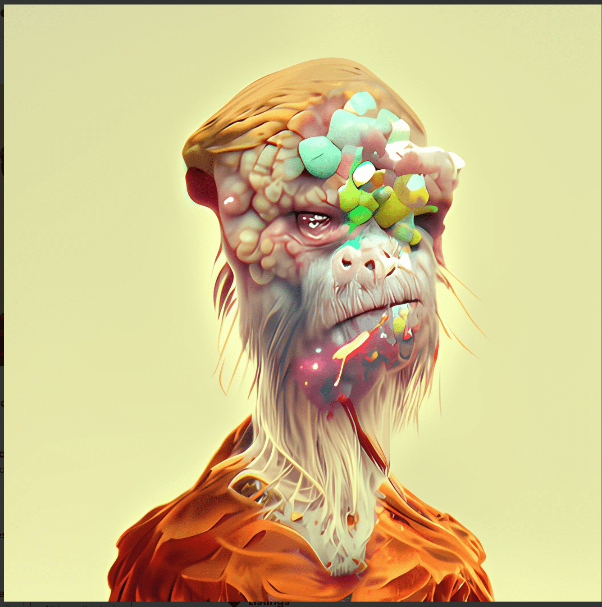

# DeGenerative Apepes

在实验室里，古怪的 Borja 博士创造了一种血清，这种血清本应通过给每个陷入困境的灵魂带来欢笑和欢乐来拯救世界免于抑郁症。由于一个可怕的错误，他弄错了混合物，相反，血清使对象的外表变得无法识别。

测试对象；一些支付 0.01 eth 进入的稀有猿猴看到自己变成了什么样子后，愤怒地摧毁了实验室。医生逃跑了，退化的猿人拿走了所有的血清，并建立了一支退化猿人的军队来接管世界，让人们摆脱模因。

1,500 个无模因的 degens 没有什么可失去的，他们不给任何宿舍，也不做任何承诺。只有一个 Twitter 帐户代表他们进行报告。

