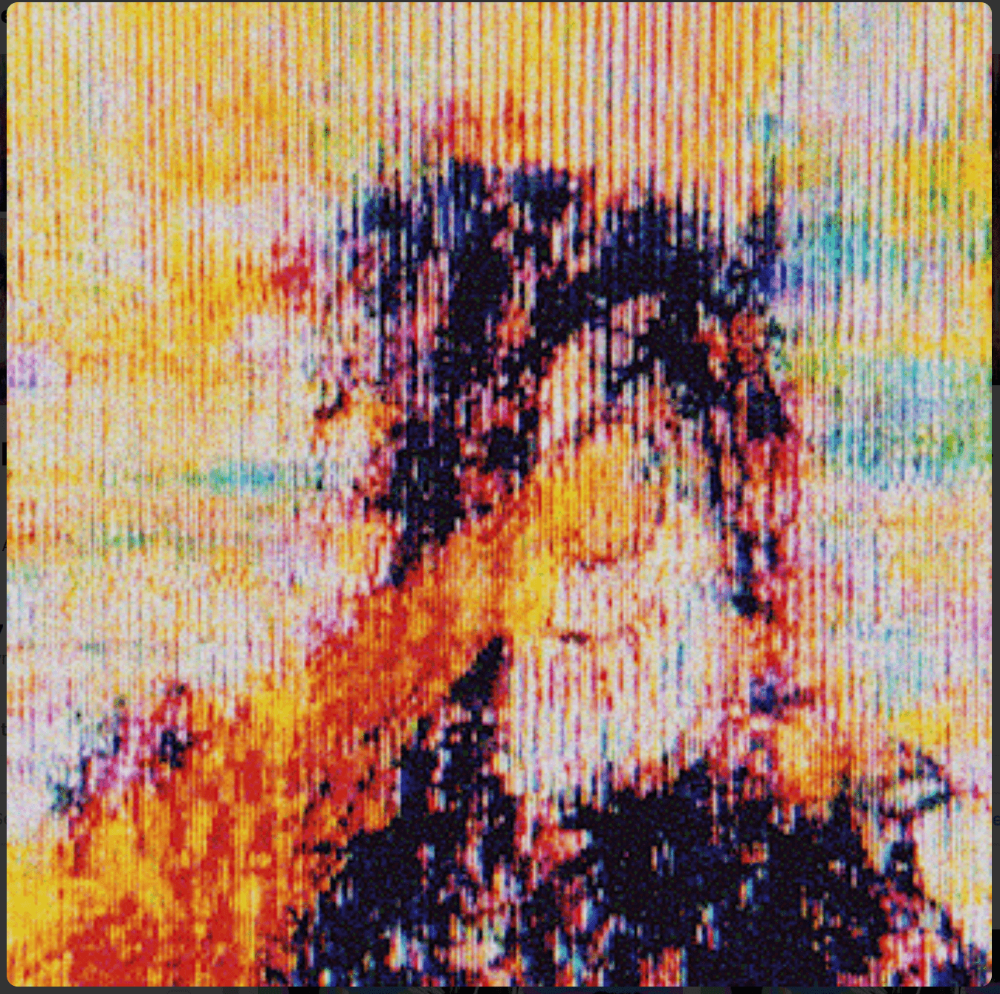

# DEGENERATIVE ART by JAKE

JAKE 的 DEGENERATIVE ART 是一系列独特的版本作品。最终输出是跨多种媒体（模拟和数字）的实验 + 创作，这是一种非正统的 DIY 方法。

歧管的 ERC-721 合同JAKE NFT 的退化艺术 - 常见问题（FAQ）
▶ JAKE 的退化艺术是什么？
JAKE 的 DEGENERATIVE ART 是一个 NFT（不可替代令牌）集合。存储在区块链上的数字艺术品集合。
▶ JAKE 代币的 DEGENERATIVE ART 有多少？
JAKE NFT 共有 165 种退化艺术。目前，118 位所有者的钱包中至少有一件 JAKE NTF 的 DEGENERATIVE ART。
▶ JAKE 拍卖中最昂贵的 DEGENERATIVE ART 是什么？
JAKE NFT 售出的最昂贵的 DEGENERATIVE ART 是 SCREENTIME #27。它于 2022 年 6 月 12 日（3 个月前）以 340 美元的价格售出。
▶ JAKE 最近卖出了多少 DEGENERATIVE ART？
在过去的 30 天里，JAKE NFT 售出了 40 件 DEGENERATIVE ART。
▶ JAKE 的 DEGENERATIVE ART 需要多少钱？
过去 30 天，JAKE NFT 最便宜的 DEGENERATIVE ART 销售额低于 699 美元，最高销售额超过 2712 美元。 JAKE NFT 的 DEGENERATIVE ART 在过去 30 天内的中位价格为 1004 美元。
▶ JAKE 流行的 DEGENERATIVE ART 替代品有哪些？
许多拥有 JAKE NFT 的 DEGENERATIVE ART 的用户还拥有 Reflections of Simplicity、-MEIOS-、Dream_Savers_Mirror 和奇怪的世界形状。

