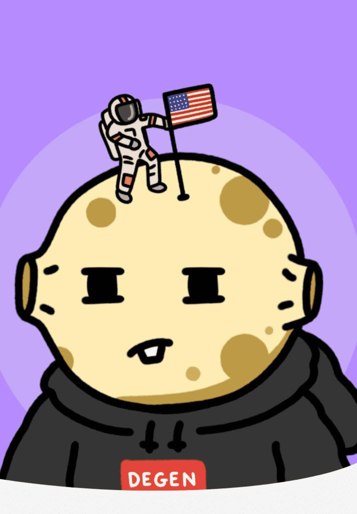

# DegenMoonFrens

DegenMoonFrens 是谁？
DegenMoonFrens 是一个由 4,444 名朋友组成的集合，他们住在夜间，翻转 NFT 并通过互联网与陌生人建立联系。我们的目标是创建一个由希望看到 NFT 世界蓬勃发展的建设者和艺术家组成的高度积极的社区。我们努力提供良好的氛围、出色的 alpha 和精彩的现场活动和商品，我们所有的朋友都可以聚在一起参与德根恶作剧。Degen Moon Fren 是一个由 3 名加密原住民组成的团队，旨在重新定义 PFP NFT 领域的质量和透明度标准。我们的使命是为 NFT 新人创造一个受欢迎的入职体验，同时为我们的持有者提供可观的价值，无论是新手还是经验丰富的人。我们定制的“邀请列表”打破了白名单研磨的模式，因为我们不想浪费您的时间来执行多余的任务。获得邀请并邀请您的朋友创建一个 alpha 共享 degens 的超级社区。

