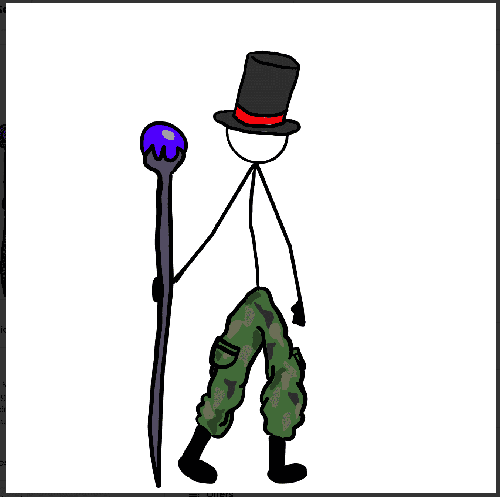

# DegenShticks

这是虚构的：Mr.Stick 偷了我的主意。你能想象在 DEGEN 免费薄荷季节为简笔画收费吗？用免费的 2,222 供应把它送给那个人。每个钱包一个。DegenShticks NFT - 常见问题（FAQ）
▶ 什么是 DegenShticks？
DegenShticks 是一个 NFT（不可替代令牌）集合。存储在区块链上的数字艺术品集合。
▶ 有多少 DegenShticks 代币？
总共有 2,222 个 DegenShticks NFT。目前，1,328 位所有者的钱包中至少有一个 DegenShticks NTF。
▶ 什么是最昂贵的 DegenShticks 销售？
售出的最昂贵的 DegenShticks NFT 是 Degen Shticks #69。它于 2022 年 6 月 5 日（3 个月前）以 1.1 万美元的价格售出。
▶ 最近卖出了多少 DegenShticks？
过去 30 天内售出了 971 个 DegenShticks NFT。
▶ DegenShticks 多少钱？
在过去 30 天里，最便宜的 DegenShticks NFT 销售额低于 11 美元，最高销售额超过 71 美元。在过去 30 天内，DegenShticks NFT 的中位价格为 23 美元。
▶ 什么是流行的 DegenShticks 替代品？
许多拥有 DegenShticks NFT 的用户还拥有 MakeItMakeSense、Bad Break Social Club、I'm Tired NFT 和 Demon Time WTF。

