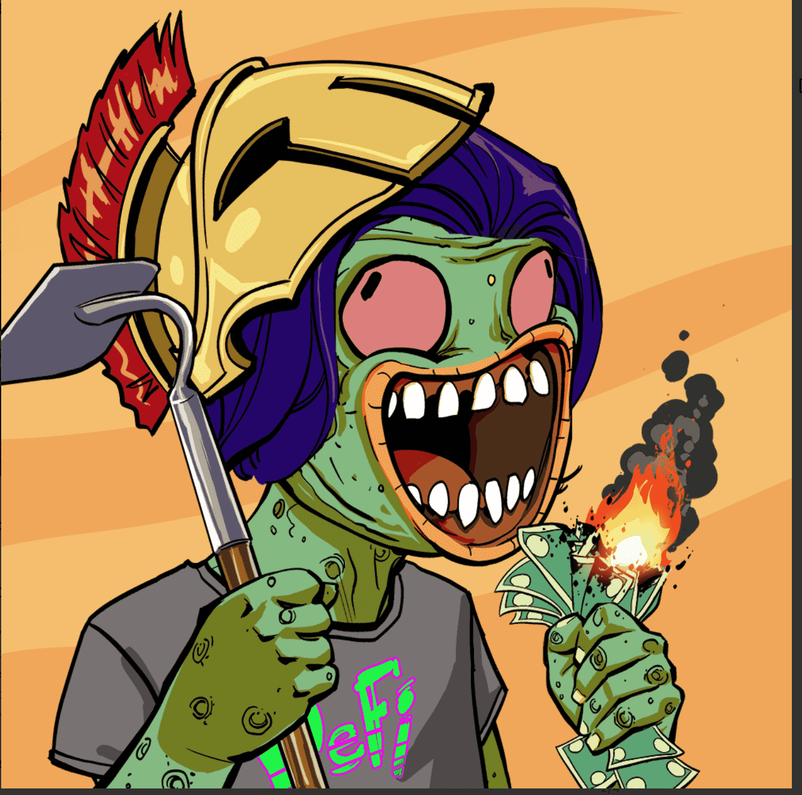

# Degenz

什么是德根茨？
Degenz 是一个围绕加密和 NFT 的堕落者在线社区。我们为会员撰写每日市场更新，并针对特定项目制作多份每周 NFT 报告。

我们是一个轻松的社区，并鼓励所有新成员，无论您是新手还是加密老手！Degenz 是由 3,943 个独特角色组成的集合，其灵感来自加密文化文化，并存储在以太坊区块链上。我们是一个围绕加密货币和 NFT 的堕落者社区。

注意：这些 NFT 只为您提供有限的 Discord 访问权限，要完全访问我们的社区，您将需要 Degenz 访问通行证。
