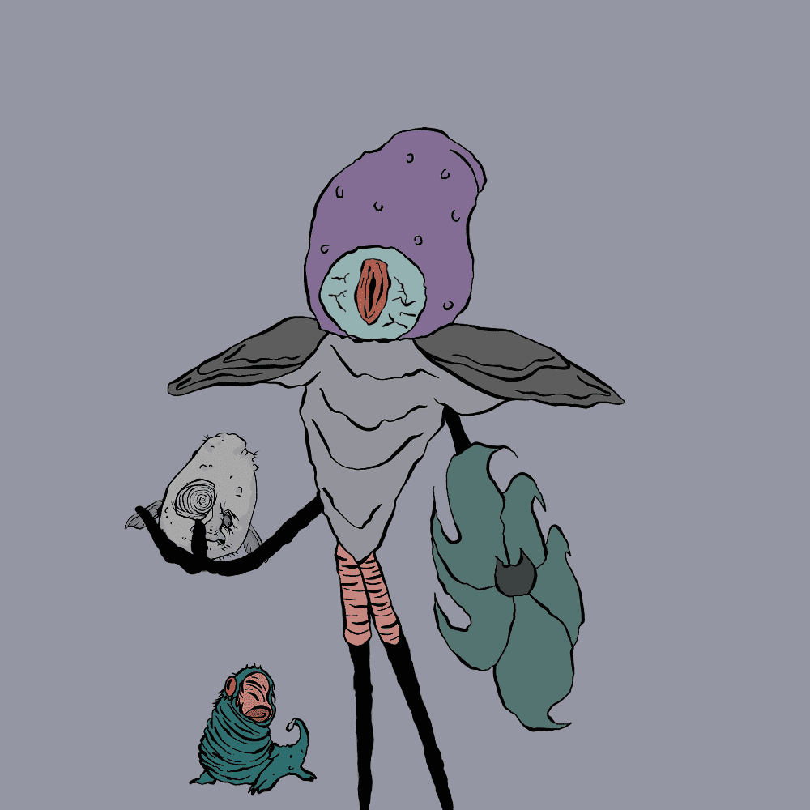

# dementorstown.wtf

dementorstown.wtf NFT - 常见问题（FAQ）
▶ 什么是 dementorstown.wtf？
dementorstown.wtf 是一个 NFT（非同质代币）集合。存储在区块链上的数字艺术品集合。
▶ 有多少 dementorstown.wtf 代币？
总共有 6,666 个 dementorstown.wtf NFT。目前，1,484 位业主的钱包中至少有一个 dementorstown.wtf NTF。
▶ 最昂贵的 dementorstown.wtf 销售是什么？
最昂贵的 dementorstown.wtf NFT 是 Dementorstown #5259。它于 2022-07-04（大约 2 个月前）以 3.3 美元的价格售出。
▶ 最近卖了多少 dementorstown.wtf？
过去 30 天内售出了 11 个 dementorstown.wtf NFT。
▶ dementorstown.wtf 需要多少钱？
在过去 30 天内，最便宜的 dementorstown.wtf NFT 销售额低于 0 美元，最高销售额超过 15 美元。dementorstown.wtf NFT 在过去 30 天内的中位价格为 2 美元。
▶ 什么是流行的 dementorstown.wtf 替代品？
许多拥有 dementorstown.wtf NFT 的用户还拥有 FOREST by METASQUATCH、 3D Goblinz、 MoonKiller Official和 BadBugz。

