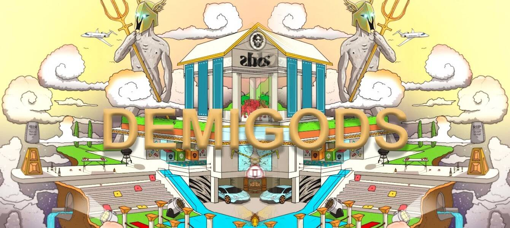

# DEMIGODS Reborn

▶ 什么是半神重生？
DEMIGODS Reborn 是一个 NFT（不可替代代币）集合。存储在区块链上的数字艺术品集合。
▶ DEMIGODS Reborn 代币有多少？
总共有 10,000 个 DEMIGODS Reborn NFT。目前，1,009 位所有者的钱包中至少有一个 DEMIGODS Reborn NTF。
▶ DEMIGODS Reborn 最昂贵的促销活动是什么？
最昂贵的 DEMIGODS Reborn NFT 是 Unrevealed DemiGod #2883。它于 2022 年 6 月 24 日（2 个月前）以 0.8 美元的价格出售。
▶ 最近卖出了多少《DEMIGODS Reborn》？
过去 30 天内售出了 1 个 DEMIGODS Reborn NFT。
▶ 什么是流行的 DEMIGODS Reborn 替代品？
许多拥有 DEMIGODS Reborn NFT 的用户还拥有 Mistryuss Eggies、 Maze Collective Membership、 momoMOMOmomo和 Ethereum DeGods。

