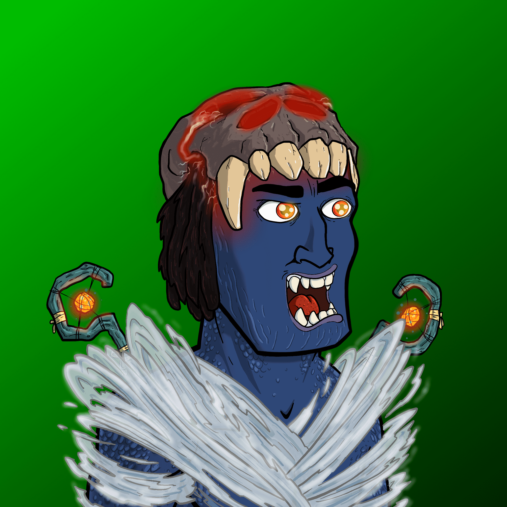

# DemiGods Of Rock

▶ 什么是半神岩？
DemiGods Of Rock 是一个 NFT（非同质代币）集合。存储在区块链上的数字艺术品集合。
▶ 岩石半神代币有多少个？
总共有 1,064 个半神岩 NFT。目前，677 位所有者的钱包中至少有一个 DemiGods Of Rock NTF。
▶ 什么是最昂贵的半神摇滚销售？
最昂贵的 DemiGods Of Rock NFT 是 DemiGods Of Rock #43。它于 2022-08-24（3 天前）以 225.1 美元的价格售出。
▶ 最近卖出了多少部岩石半神？
过去 30 天内共售出 53 个半神岩 NFT。
▶ 岩石半神要多少钱？
过去 30 天，最便宜的 DemiGods Of Rock NFT 销售额低于 47 美元，最高销售额超过 125 美元。DemiGods Of Rock NFT 的中位价格在过去 30 天内为 84 美元。
▶ 什么是流行的 DemiGods Of Rock 替代品？
许多拥有 DemiGods Of Rock NFT 的用户还拥有 Tools Of Rock、 Gods Of Rock、 EL NUMEROS和 DegenOkayBears。

