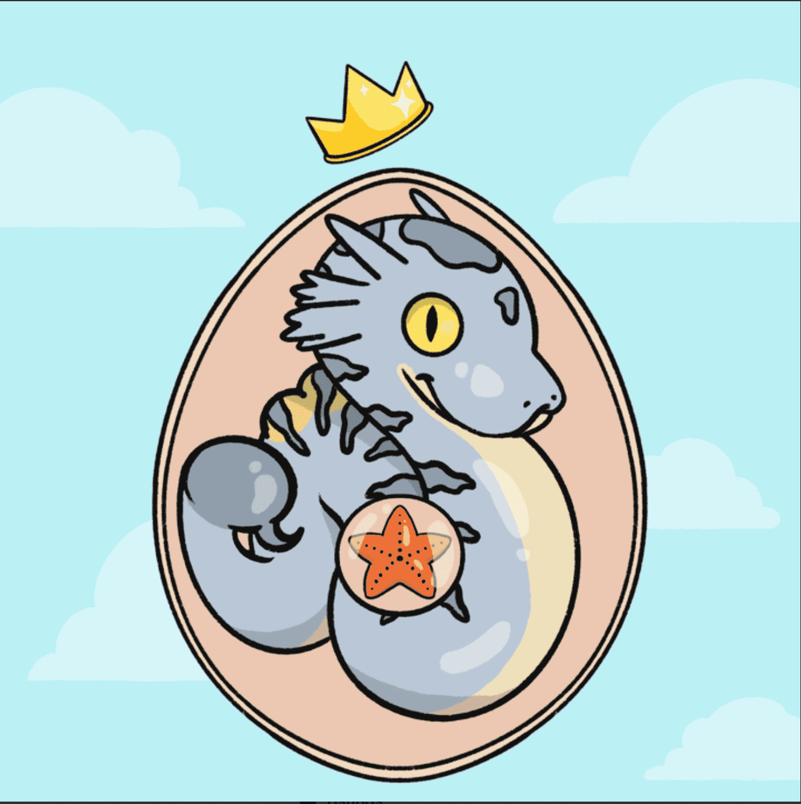

# Demon Party: Dragonfall

我们都有。我们迫切希望向世界其他地方隐瞒的事情。我们害怕面对自己的事情。遗憾、恐惧、挣扎、不安全感、弱点……
个人恶魔。

虽然我们可能害怕面对它们，但现在是时候拥抱它们了……恶魔派对：Dragonfall 是 300 个 NFT 的集合，代表着恶魔与龙之间特殊纽带的开始。每个持有者都将在主要的恶魔派对 NFT 铸币期间获得折扣。恶魔派对：Dragonfall NFT - 常见问题（FAQ）
▶ 什么是恶魔派对：龙陨？
Demon Party: Dragonfall 是一个 NFT（非同质代币）集合。存储在区块链上的数字艺术品集合。
▶ Demon Party: Dragonfall 代币有多少？
总共有 300 个恶魔派对：Dragonfall NFT。目前 196 位所有者的钱包中至少有一个恶魔派对：Dragonfall NTF。
▶ 什么是最昂贵的恶魔派对：龙陨特卖？
最昂贵的恶魔派对：Dragonfall NFT 出售的是恶魔派对 Dragonfall #45。它于 2022 年 6 月 9 日（3 个月前）以 54.2 美元的价格售出。

