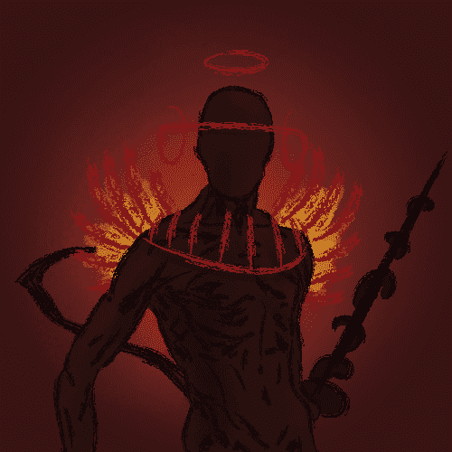

# DemonicDivision

▶ 什么是恶魔师？
DemonicDivision 是一个 NFT（非同质代币）集合。存储在区块链上的数字艺术品集合。
▶ DemonicDivision 代币有多少？
总共有 6,665 个 DemonicDivision NFT。目前，2,698 位所有者的钱包中至少有一个 DemonicDivision NTF。
▶ 什么是最昂贵的 DemonicDivision 销售？
最昂贵的 DemonicDivision NFT 是 Demonic Division #3106。它于 2022-06-11（3 个月前）以 33.4 美元的价格售出。
▶ 最近卖了多少恶魔师？
过去 30 天内共售出 359 个 DemonicDivision NFT。
▶ 恶魔师的费用是多少？
过去 30 天，最便宜的 DemonicDivision NFT 销售额低于 6 美元，最高销售额超过 14 美元。过去 30 天内，DemonicDivision NFT 的中位价格为 10 美元。
▶ 什么是流行的 DemonicDivision 替代品？
许多拥有 DemonicDivision NFT 的用户还拥有 Sleepers、 WizardTown.wtf GENESIS、 ethgames SZN 0/WK 1和 Crypto Midgetz。

