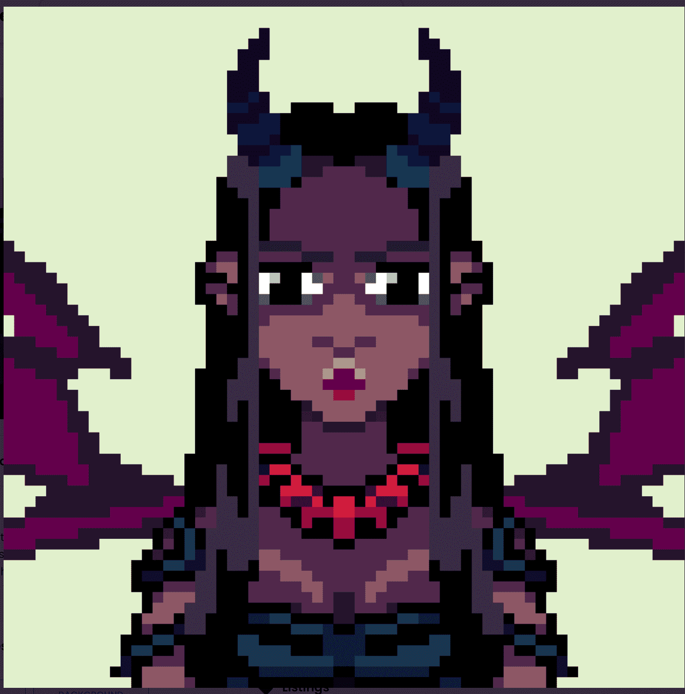

# Demonix NFT

相传，女神维纳斯哭泣，用眼泪制成岩石，然后散落在地球上，变成缟玛瑙石——承载着女神的能量，成为护身符，但堕落天使拿走了这些碎片，创造了恶魔吊坠.所有发现这些珠宝的女人散落在大地上，都直接进入了冥界，获得了黑魔法的力量。Demonix NFT NFT - 常见问题（FAQ）
▶ 什么是 Demonix NFT？
Demonix NFT 是一个 NFT（Non-fungible token）集合。存储在区块链上的数字艺术品集合。
▶ 存在多少 Demonix NFT 代币？
总共有 6,665 个 Demonix NFT NFT。目前，2,376 位所有者的钱包中至少有一个 Demonix NFT NTF。
▶ 最昂贵的 Demonix NFT 销售是什么？
出售的最昂贵的 Demonix NFT NFT 是 Demonix #2962。它于 2022 年 6 月 21 日（2 个月前）以 159.2 美元的价格售出。
▶ 最近卖出了多少 Demonix NFT？
过去 30 天内共售出 1,990 个 Demonix NFT NFT。
▶ 一个 Demonix NFT 需要多少钱？
在过去 30 天里，Demonix NFT 最便宜的 NFT 销售额低于 1 美元，最高销售额超过 14 美元。过去 30 天，Demonix NFT NFT 的中位价格为 6 美元。
▶ 什么是流行的 Demonix NFT 替代品？
许多拥有 Demonix NFT NFT 的用户还拥有 Goblinverz.wtf、Thieves.NFT、Get Fuckd 和 Kodachrome V2。

