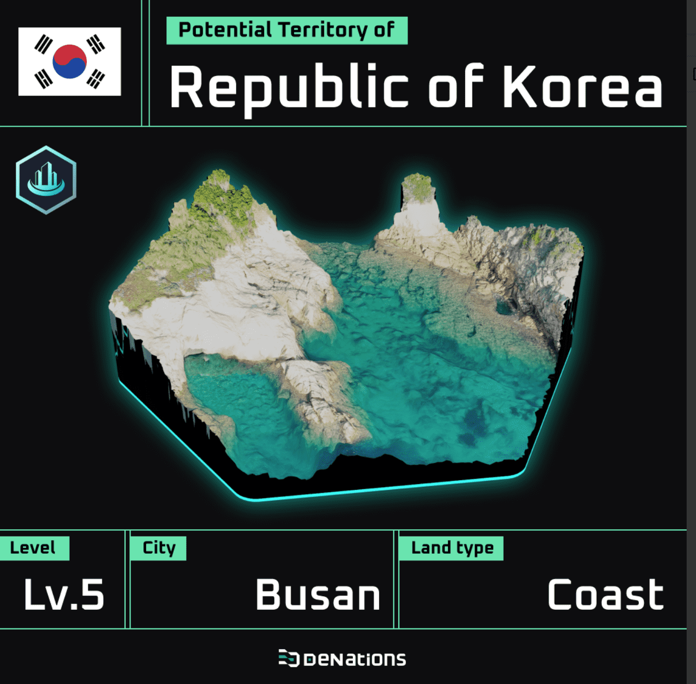

# DeNations LAND MintPass

DeNations Metaverse 拥有 390,000 块土地，每块土地都有其独特的位置和内在属性。土地所有权由区块链上的 NFT 认证，确保数字稀缺性、真实性和交易。土地可用于公民居住和生产资源。土地一旦与国家所有权联系起来，就可以成为国家的领土。DeNations Land 是 DeNations 虚拟世界中地球表面的数字形式。 DeNations 的地球被分成 390,000 个六边形。每块土地都有自己的坐标（例如 115,132）和内部属性。土地以NFT为代表，可在本店进行交易。DeNations Citizen将可以从DeNations Land中游玩和耕种独特的资源，创造出多种新的文明NFT，未来可在公开市场进行交易。了解有关 DeNations Land 的更多信息 官方 Twitter 加入 DeNations 社区

