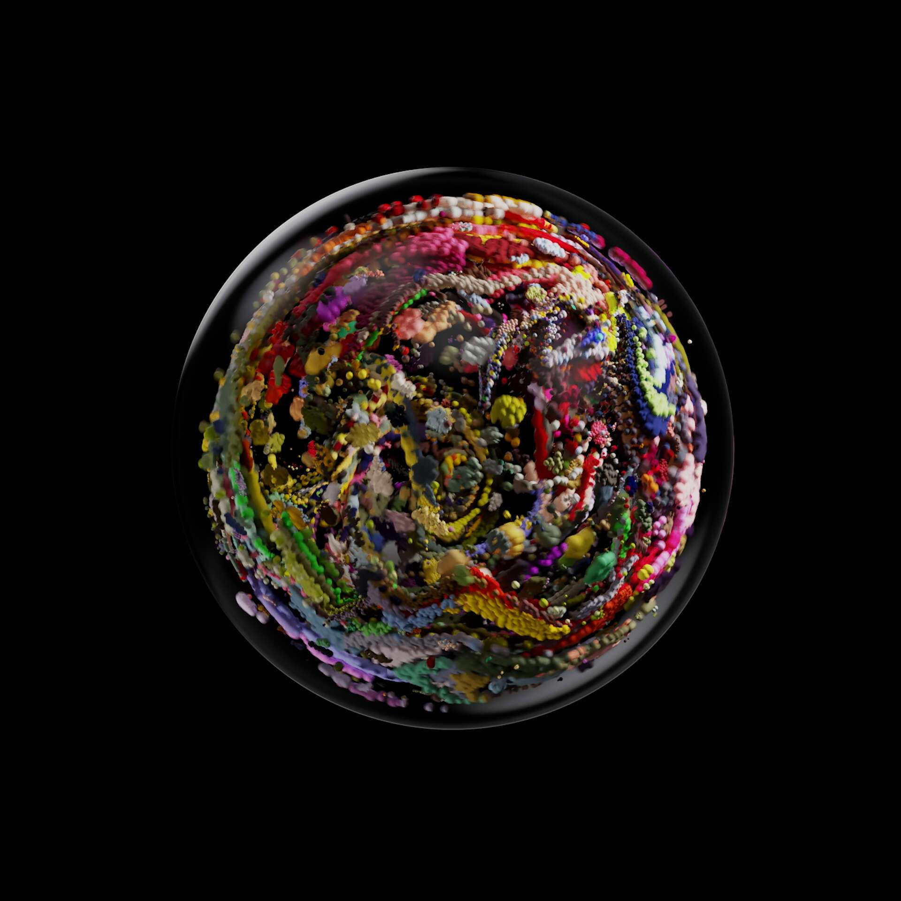

# denzaglobes

!denzadol 是第一个系列 1024 生成 3D 作品。该系列可在 Looks Rare、Zora 和 Coinbase NFT 市场上购买。

系列一在发布后从 OpenSea 中除名，为了解决这个问题，将重新发布作为原始收藏所有者免费薄荷的一部分，并生成新的、更复杂的艺术品。

!denzaglobes 使用 !floradenza 作为颜色数据输入来生成 !denzaglobes 的外观。

!floradenza 由艺术家 errorgardener 创作，使用自定义机器学习/人工智能算法对他自己的一组鲜花和 fidenza 进行训练，创造出独特而迷人的系列作品。

