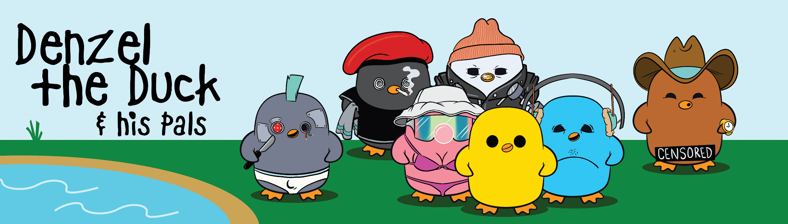

# Denzel The Duck

丹泽尔的 5,500 位好朋友合集。该项目属于公共领域；随意使用任何你想要的鸭子。你是丹泽尔的朋友吗？没有路线图，没有承诺，没有不和谐。这只是一只鸭子。前 500 名免费。

▶ 什么是丹泽尔鸭？
Denzel The Duck 是一个 NFT（非同质代币）集合。存储在区块链上的数字艺术品集合。
▶ 有多少 Denzel The Duck 代币？
总共有 5,500 个 Denzel The Duck NFT。目前，503 位车主的钱包中至少有一本 Denzel The Duck NTF。
▶ Denzel The Duck 最近卖出了多少？
过去 30 天内售出 0 个 Denzel The Duck NFT。
▶ 什么是流行的 Denzel The Duck 替代品？
许多拥有 Denzel The Duck NFT 的用户还拥有 MissCryptoClub、 EL NUMEROS、 DegenOkayBears和 WaterBe4nZuki。

