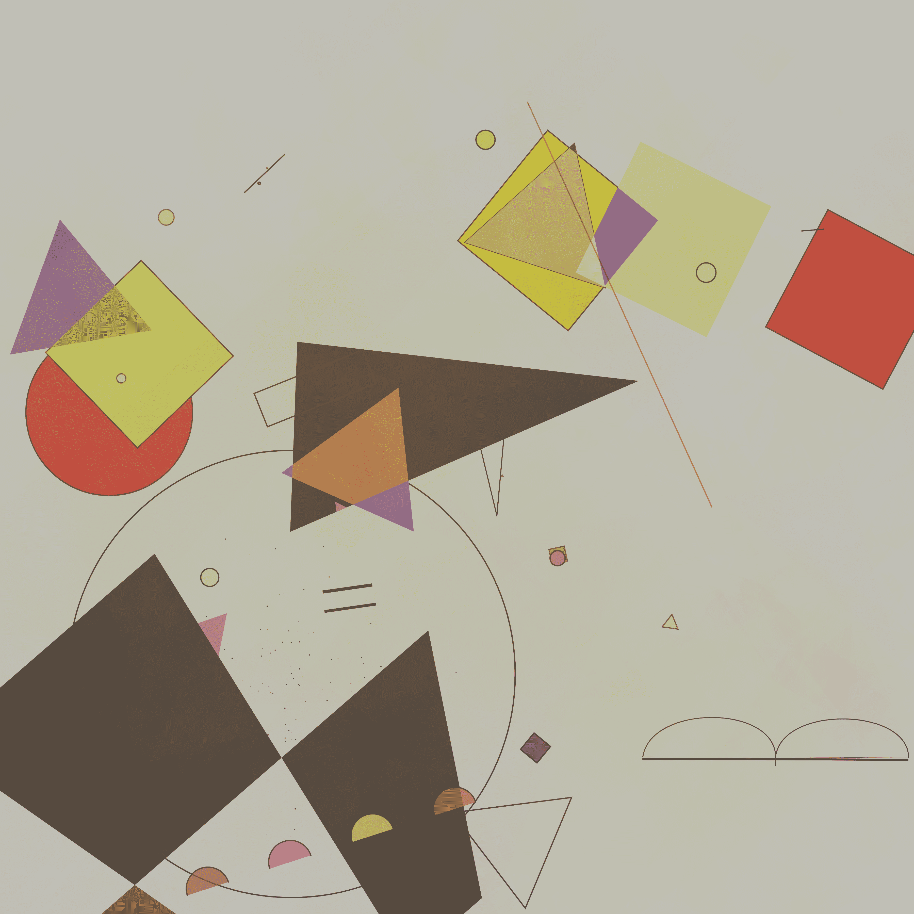

# Depictives

该系列是使用基于基础数学、色彩理论和设计构图的算法生成的，目的是构建受瓦西里康定斯基作品启发的抽象作品，特别是参考他在 1920 年代和他在包豪斯时期的作品。被认为是抽象运动之父，他引人入胜的作品通过这些形状之间的有目的的相互作用，将看似随机的元素集合转化为产生秩序和凝聚力的片段。

Depictives 设计算法通过看似混乱的设计探索和发展了这一目标理念；生成一个由颜色、碰撞、原点和矢量组成的画布，这些画布结合起来组装形状和结果。即使有大量的随机变量、参数和潜在输出，对于那些仔细观察的人来说，也可以在这 2048 个独特的部分中找到顺序。

敏感的框架在八个特征中创建了广泛的结果：碎片、尖、柔和、轻、最小、多边形、经典和放大。

我希望您在这种数字艺术媒介中对康定斯基的抽象作品进行独特的重新想象，分享我的乐趣。

