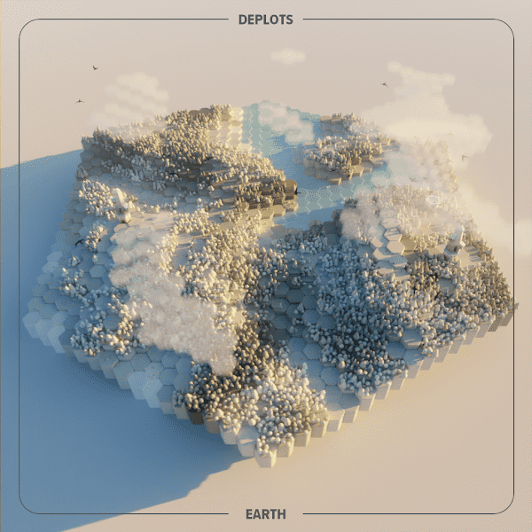

# DePlots

DePlots 是程序生成的艺术品，描绘了多边形协议上的多边形景观。我们将用团队树种植 1 棵树！免责声明：DePlots 目前与元宇宙或实际数字土地没有任何关联。情节只是艺术品。将来，地块持有者可能会获得这些功能。

**DePlots NFT - 常见问题（FAQ）**
▶ 什么是 DePlot？
DePlots 是一个 NFT（不可替代代币）集合。存储在区块链上的数字艺术品集合。
▶ 有多少 DePlots 代币？
总共有 648 个 DePlots NFT。目前，63 位所有者的钱包中至少有一个 DePlots NTF。
▶ 最近卖出了多少 DePlot？
过去 30 天内售出 0 个 DePlots NFT。

