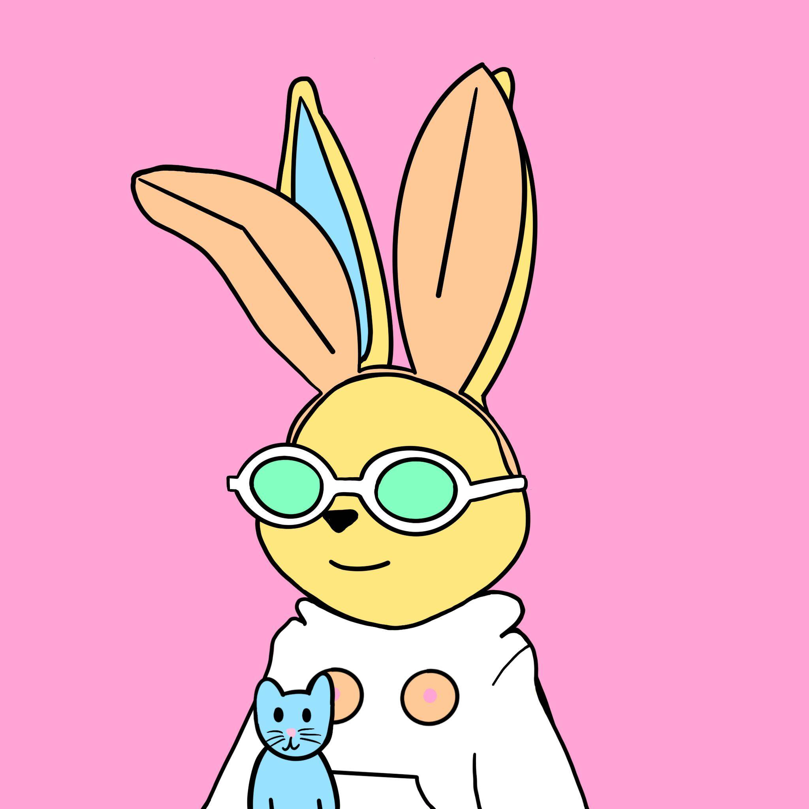

# DERABBADOOS

Derabbadoo's 是一个 Derrabative 项目，只是为了好玩！

这是一款免费薄荷糖，适用于 Rabbitar Hodlers 或 Snakehodlers。

该项目没有官方隶属关系，是一个社区 Derrabative，是 TY/XMAS 礼物。Rabbitar Hodlers & Snakehodlers 不公开发售，先到先得。除了对项目和风格的热爱之外，与 Doodles 或 Rabbitars 没有任何关系。支持他们！

▶ 什么是 DERABBADOOS？
DERABBADOOS 是一个 NFT（不可替代令牌）集合。存储在区块链上的数字艺术品集合。
▶ 有多少个 DERABBADOOS 代币？
总共有 2,604 个 DERABBADOOS NFT。目前，1,235 位所有者的钱包中至少有一个 DERABBADOOS NTF。
▶ 最昂贵的 DERABBADOOS 销售是什么？
最昂贵的 DERABBADOOS NFT 是 Derabbadoo 163。它于 2022-06-08（3 个月前）以 9.1 美元的价格售出。
▶ 最近卖出了多少 DERABBADOOS？
过去 30 天内售出了 4 个 DERABBADOOS NFT。
▶ 什么是流行的 DERABBADOOS 替代品？
许多拥有 DERABBADOOS NFT 的用户还拥有 Vincent Van Borp、 Salvador Borpi、 Playboy Hare Drops和 Borpacasso。

