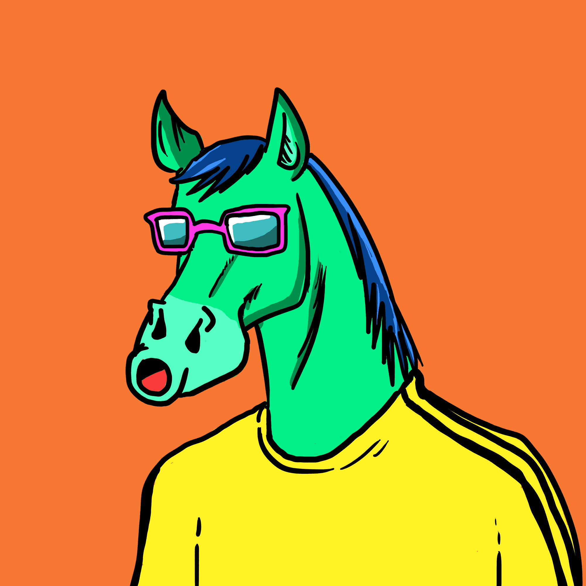

# DeRace Jockey

DeRace 是一个完整的 NFT 赛马虚拟世界，您可以在其中参加赛马、培育具有独特特征的 NFT 马、建立自己的 NFT 赛马场并通过我们的可持续 P2E 机制获得奖励，同时进行所有这些操作。

**DeRace 赛马会 NFT - 常见问题（FAQ）**
▶ 什么是 DeRace 赛马会？
DeRace Jockey Club 是一个 NFT（非同质代币）集合。存储在区块链上的数字艺术品集合。
▶ 有多少 DeRace Jockey Club 代币？
总共有 5,000 个 DeRace Jockey Club NFT。目前，1,637 位车主的钱包中至少有一个 DeRace Jockey Club NTF。
▶ 最昂贵的 DeRace 赛马会拍卖会是什么？
售出的最昂贵的 DeRace Jockey Club NFT 是 DeRace Opie 1553。它于 2022-08-12（16 天前）以 703.5 美元的价格售出。
▶ 最近卖出了多少台 DeRace 赛马会？
过去 30 天内共售出 47 个 DeRace Jockey Club NFT。
▶ DeRace 赛马会的费用是多少？
过去 30 天，最便宜的 DeRace Jockey Club NFT 销售额低于 141 美元，最高销售额超过 270 美元。过去 30 天内，DeRace Jockey Club NFT 的中位价格为 167 美元。
▶ 什么是流行的 DeRace 赛马会替代品？
许多拥有 DeRace Jockey Club NFT 的用户还拥有 DeRace Liquid Love、 DeRace Horses、 Footballers和 Horse Town Club。

