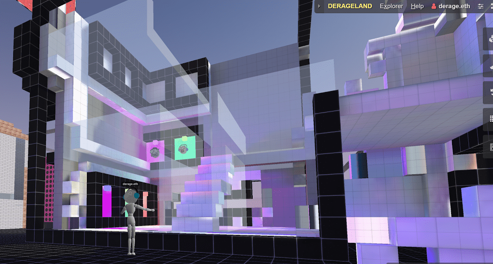

# Derage Voxels

▶ 什么是 Derage 体素？
Derage Voxels 是一个 NFT（不可替代代币）集合。存储在区块链上的数字艺术品集合。
▶ 存在多少 Derage Voxels 代币？
总共有 10 个 Derage Voxels NFT。目前，34 位所有者的钱包中至少有一个 Derage Voxels NTF。
▶ 什么是最昂贵的 Derage Voxels 销售？
最昂贵的 Derage Voxels NFT 是 DERAGEHEAD #7。它于 2022-07-02（大约 2 个月前）以 54.9 美元的价格售出。
▶ 最近卖出了多少 Derage Voxels？
过去 30 天内售出了 2 个 Derage Voxels NFT。
▶ 什么是流行的 Derage Voxels 替代品？
许多拥有 Derage Voxels NFT 的用户还拥有 KERO EDITIONS、 Hexx Audio: Dreamscapes、 KERO EDITIONS和 LOOPING LAB WALK。

