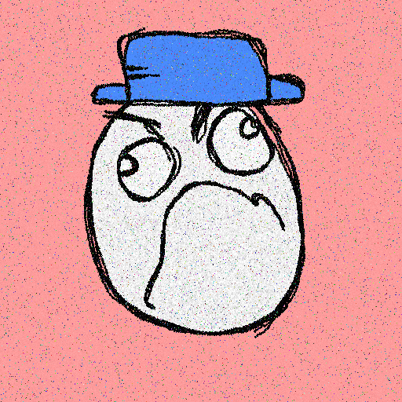

# Derage

Darkfarms1 的 4201 Degen Rage 衍生系列

Derage NFT - 常见问题（FAQ）
▶ 什么是贬义？
Derage 是一个 NFT（不可替代代币）集合。存储在区块链上的数字艺术品集合。
▶ 有多少 Derage 代币？
总共有 4,201 个 Derage NFT。目前，1,350 名所有者的钱包中至少有一个 Derage NTF。
▶ 最昂贵的 Derage 销售是什么？
出售的最昂贵的 Derage NFT 是 Derage #3355。它于 2022 年 6 月 11 日（3 个月前）以 842.6 美元的价格售出。
▶ 最近卖出了多少台 Derage？
过去 30 天内售出了 242 个 Derage NFT。
▶ Derage 的费用是多少？
在过去 30 天里，最便宜的 Derage NFT 销售额低于 54 美元，最高销售额超过 173 美元。Derage NFT 在过去 30 天内的中位价格为 82 美元。
▶ 什么是流行的 Derage 替代品？
许多拥有 Derage NFT 的用户还拥有 SMOWL、 Pet Rock Collection、 CREYZIES和 frankfrank。

