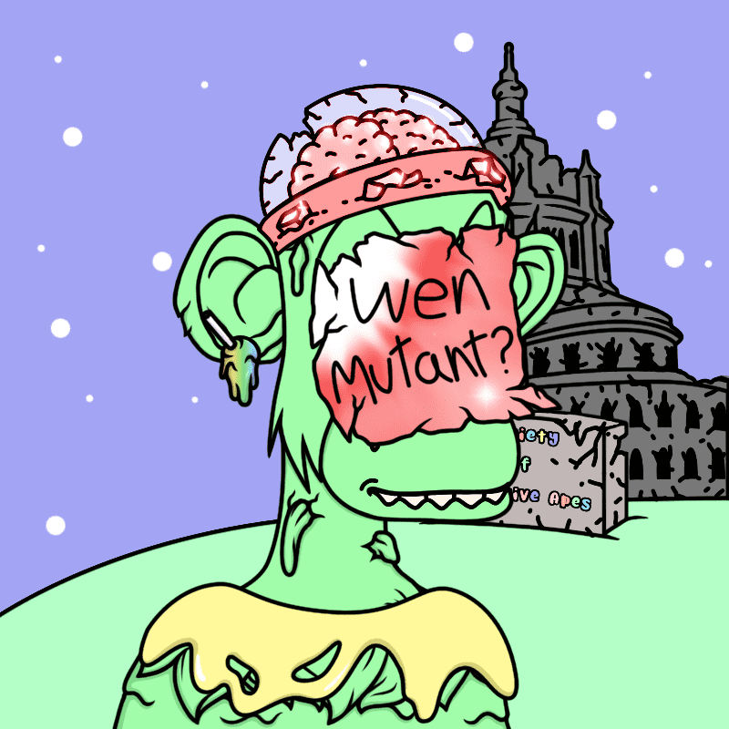

# Society of Deranged Apes (SODA Mutants)

▶ 什么是疯狂猿协会（SODA 突变体）？
疯狂猿协会（SODA Mutants）是一个 NFT（不可替代代币）集合。存储在区块链上的数字艺术品集合。
▶ 狂猿协会（SODA Mutants）代币有多少？
总共有 1,855 个疯狂猿协会（SODA 突变体）NFT。目前，768 位所有者的钱包中至少有一个疯狂猿协会 (SODA Mutants) NTF。
▶ 疯狂猿协会（SODA Mutants）最昂贵的销售是什么？
最昂贵的疯狂猿协会（SODA Mutants）NFT 是 Deranged Ape #1157。它于 2022-06-07（3 个月前）以 36.3 美元的价格售出。
▶ 最近卖出了多少疯狂猿协会（SODA Mutants）？
过去 30 天内售出了 14 个疯狂猿协会（SODA 突变体）NFT。
▶ 疯狂猿协会（SODA 突变体）的费用是多少？
过去 30 天，最便宜的疯狂猿协会（SODA Mutants）NFT 销售额低于 2 美元，最高销售额超过 32 美元。过去 30 天，疯狂猿协会 (SODA Mutants) NFT 的中位价格为 9 美元。
▶ 什么是流行的疯狂猿协会（SODA 突变体）替代品？
许多拥有疯狂猿协会（SODA Mutants）NFT 的用户还拥有 退化猿协会（SODA）、 苏打罐 - 衍生猿协会、 粉彩亲信和 疯狂猿锦标赛。

