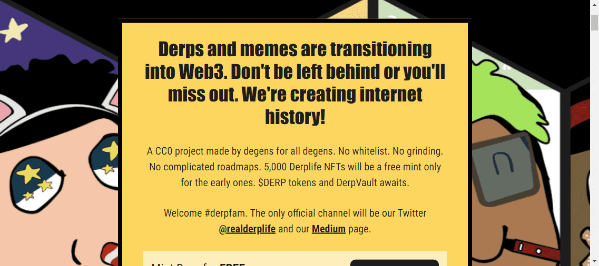

# DerpLife

**DerpLife NFT - 常见问题（FAQ）**
▶ 什么是 DerpLife？
DerpLife 是一个 NFT（Non-fungible token）集合。存储在区块链上的数字艺术品集合。
▶ 有多少 DerpLife 代币？
总共有 2,151 个 DerpLife NFT。目前，1,572 名所有者的钱包中至少有一个 DerpLife NTF。
▶ 最昂贵的 DerpLife 销售是什么？
售出的最昂贵的 DerpLife NFT 是 235。它于 2022 年 6 月 22 日（2 个月前）以 8.8 美元的价格售出。
▶ 最近卖出了多少 DerpLife？
过去 30 天内售出了 35 个 DerpLife NFT。
▶ DerpLife 的费用是多少？
在过去 30 天里，最便宜的 DerpLife NFT 销售额低于 2 美元，最高销售额超过 8 美元。DerpLife NFT 在过去 30 天内的中位价格为 4 美元。
▶ 什么是流行的 DerpLife 替代品？
许多拥有 DerpLife NFT 的用户还拥有 BAGC、 Angry Gorilla Club Collectables、 带有 $BUNC 代币的 Crypto Punk Bunnies和 KnightSpritez。

