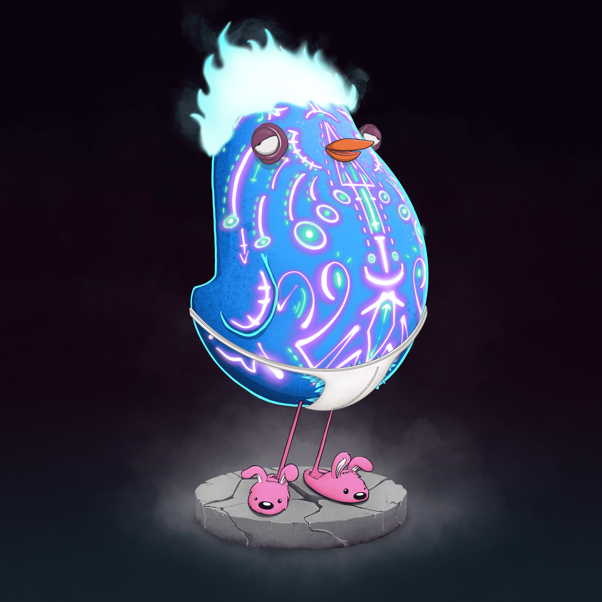

# Derpy Birbs: Next Generations

故事始于 8192 件最优质的Birbs，这些Birbs 诞生于我们团队中的天才艺术家Process Smith 多年的素描和绘画。每个 Birb 都是由具有不同稀有性的特征池组装而成，这些特征以编程方式分配并存储在 IPFS 上。没有人知道它们来自哪里，但像大多数鸟一样，它们喜欢产卵，这些卵会孵化成新的、令人惊讶的资产！

**交配电话**
交配任何两个 Gen 1 Birbs 将产生一个鸡蛋。这是通过 我的鸟嘴页面并且是免费的+气体。Birbs 在交配过程中不会被烧毁，您可以保留您的 Gen 1 Birbs！

您可以随时交配，没有匆忙也没有时间窗口。Birbs 只能为下一代蛋交配一次，但是，Gen 1 Birbs 仍然可以为其他未来资产交配。您可以检查Birb是否已经交配 这里

