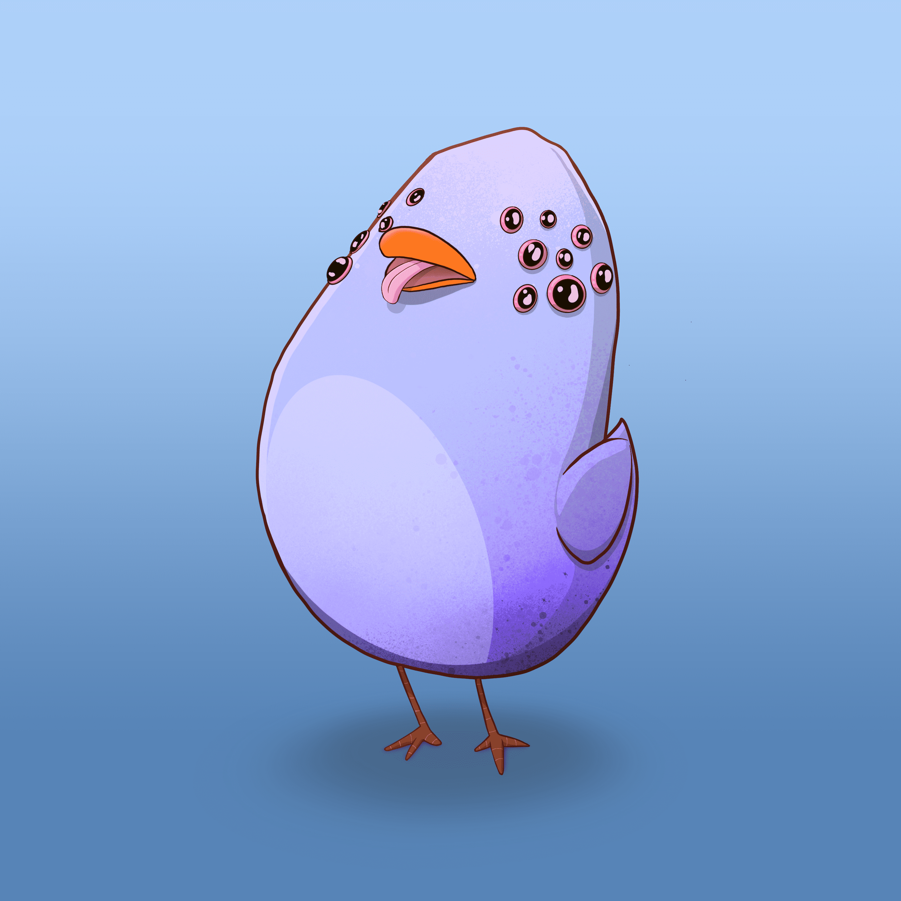

# Derpy Birbs

故事从 8192 件最优质的Birbs 开始，这些Birbs 是在我们团队中才华横溢的艺术家多年的素描和绘画之后诞生的。每个 Birb 都是由具有不同稀有性的特征池组装而成，这些特征以编程方式分配并存储在 IPFS 上。没有人知道它们来自哪里，但像大多数鸟一样，它们喜欢产卵，这些卵会孵化成新的、令人惊讶的资产！

交配任何两个 Gen 1 Birbs 将产生一个鸡蛋。这是通过 [我的鸟嘴]页面并且是免费的+气体。Birbs 在交配过程中不会被烧毁，您可以保留您的 Gen 1 Birbs！

您可以随时交配，没有匆忙也没有时间窗口。Birbs 只能为下一代蛋交配一次，但是，Gen 1 Birbs 仍然可以为其他未来资产交配。您可以检查Birb是否已经交配 

鸡蛋本身就是独特的生成艺术品。蛋艺术品将暗示您的 Gen 2 Birb 的体型，但它的其他特征在孵化之前将保持未知。

你得到的蛋壳受其父母体型的影响，而其他（隐藏的）特征则受其父母特征的稀有性影响。在鸡蛋孵化之前不可能知道这些特征，并且在交配中会有机会。这意味着 2 个稀有度较低的Birbs 可以生产出更高稀有度的鸡蛋。

