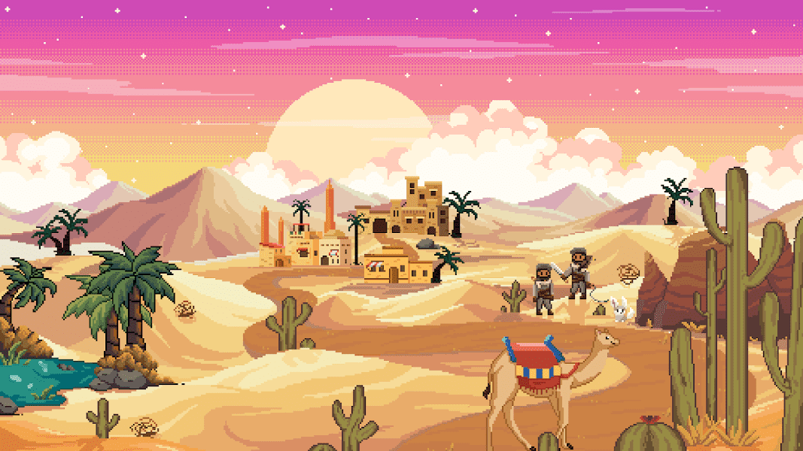

# Desert Clash

Desert Clash 是一款在 Polygon 上运行的 NFT 赌注游戏。 所有元数据和图像都是 100% 在链上生成和存储的。 游戏发生在沙漠中，人类和野生动物都在这里生活了数千年。 将有许多季节，在一个充满无限可能的世界中引入独特的故事情节。

▶ 什么是沙漠冲突？
Desert Clash 是一个 NFT (Non-fungible token) 集合。存储在区块链上的数字艺术品集合。
▶ 有多少沙漠冲突代币？
总共有 844 个沙漠冲突 NFT。目前 78 位车主的钱包中至少有一个 Desert Clash NTF。
▶ 最近卖出了多少沙漠冲突？
过去 30 天内已售出 0 个 Desert Clash NFT。

