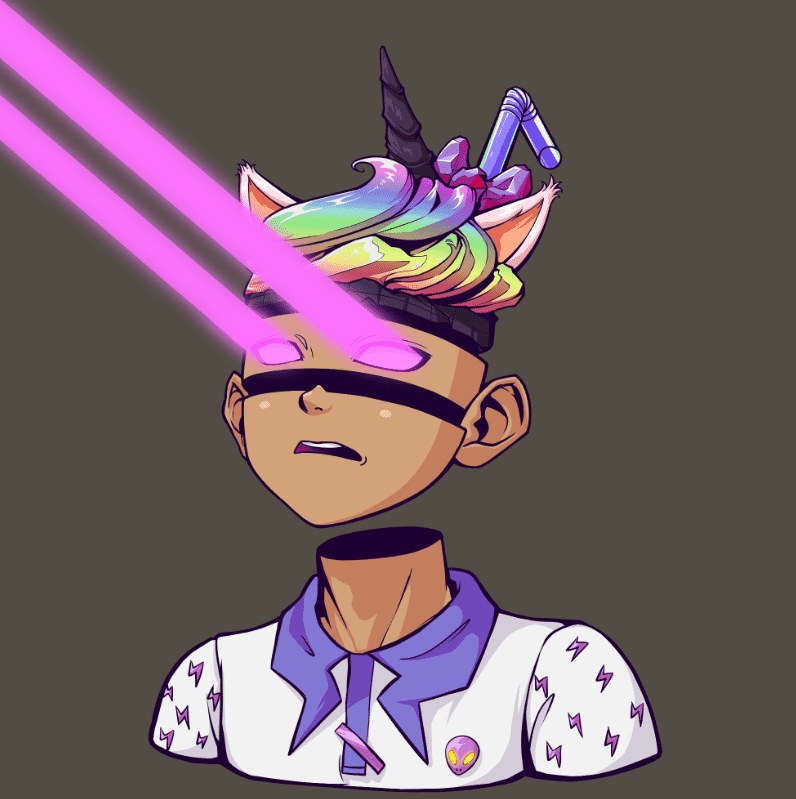

# Destroy and... Official

Destroy and... 是一个基于以太坊的 Avatar，总供应量为 5,000。 每个 NFT 都由“毁灭”和“重建”许多经典元素生成，包括经典的 NFT 蓝筹项目、知名的日本动漫、美国流行文化。 该项目旨在传达“破坏”和“重建”的精神，鼓励每个人坚持自己喜欢的东西，不断突破。 Destroy 和 NFT 可以用作 Rare NFT 空投、老虎机、Token 空投等的门票。

我偶然发现了纪录片 The First Wave。本文件详细介绍了纽约皇后区一家医院的医院工作人员和患者在 covid-19 大流行的前四个月中如何应对病毒威胁。

其中一位主角是一位当时积极寻求种族平等的非裔美国女医生。她在困难面前永不放弃的精神深深地打动了我——尽管面临巨大的威胁，但抗击流行病、争取平等的冲动依然强烈。

自从我们的项目开始以来，我们一直在思考如何为用户带来价值。如果一家公司可以让一群人变得富有，那没关系，但我认为这没什么大不了的。我希望从长远来看，我们正在做一些有价值和有意义的事情。看完这部纪录片，我想我们有了答案。

在我们看来，非裔女医生的精神可以概括为“破坏与重建”，即坚守自己所爱，敢于闯关。从“Destroy and…”开始，我们想向世界传达同样的价值和精神。

