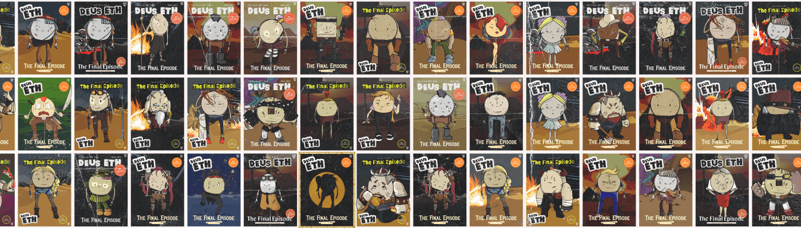

# Deus ETH Posters

2069 张海报的特别合集，海报来自原始 Deus ETH。该版本支持三年前错过的 The Final Episode 的开发。每一分钱都将用于节目的发展。关于 Deus ETHDeus ETH 是一个实验性的区块链节目，最初于 2018 年 2 月 19 日至 2018 年 4 月 13 日播出。该系列讲述了一群后世界末日的幸存者。他们依赖于管理他们的宇宙和他们的生活的契约。最后一集虽然第一季完结了，但故事还没完。为了支持 The Final Episode 的发布，我们很乐意分享一组特殊的不可替代代币或 NFT——2069 张随机生成的带有原始 Deus ETH 角色的海报。价格0-100 = 10-20 美元100-1000 = 20-50 美元1000-2000 = 40-100 美元69 张海报将免费发布给我们的社区——原始 Deus ETH 角色的持有者。

