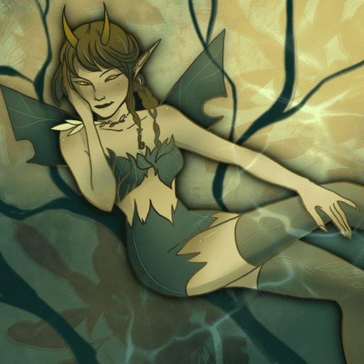

# Devil Lady Club

恶魔女士作为死亡军队的一部分被召唤。世界标准时间 2021 年 8 月 9 日晚上 11 点公布。

如此炽热，如此邪恶。他们来到这个世界，就是为了建立女魔力的力量。

未来 RPG 游戏和游戏 NFT 世界的角色。

▶ 什么是魔女俱乐部？
Devil Lady Club 是一个 NFT（Non-fungible token）集合。存储在区块链上的数字艺术品集合。
▶ 恶魔女士俱乐部代币有多少？
总共有 2,659 个 Devil Lady Club NFT。目前 595 位车主的钱包中至少有一个 Devil Lady Club NTF。
▶最近卖出了多少Devil Lady Club？
过去 30 天内共售出 0 个 Devil Lady Club NFT。

