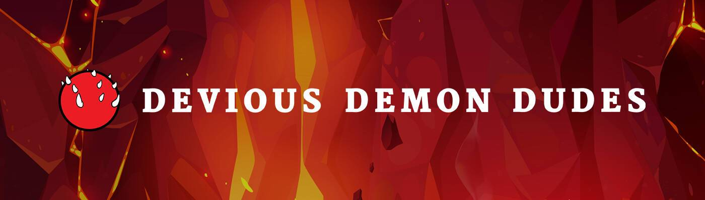

# Devious Demon Dudes

Devious Demon Dudes 是 6666 个独特的 Demon NFT 的集合。他们永远依附于以太坊区块链。每个恶魔和恶魔特征都是数字手绘，以达到狡猾的完美。DDD 是一个社区运行的项目，成员决定将资金分配到哪里，给予什么奖励，以及在元宇宙周围和之外发生什么事件。恶魔的所有权给予持续的奖励和访问 666 俱乐部。

▶ 什么是鬼鬼祟祟？
Devious Demon Dudes 是一个 NFT（非同质代币）集合。存储在区块链上的数字艺术品集合。
▶ 有多少个 Devious Demon Dudes 代币？
总共有 2,826 个 Devious Demon Dudes NFT。目前，779 位所有者的钱包中至少有一个 Devious Demon Dudes NTF。
▶ 最近卖了多少个邪魔帅哥？
过去 30 天内共售出 0 个 Devious Demon Dudes NFT。

