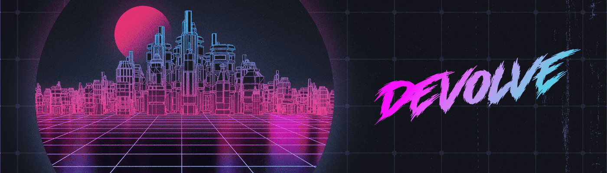

# Devolve Chapter One

▶ 什么是 Devolve 第 1 章？
Devolve Chapter One 是一个 NFT（非同质化代币）集合。存储在区块链上的数字艺术品集合。
▶ 有多少 Devolve Chapter One 代币？
总共有 3,125 个 Devolve Chapter One NFT。目前，388 位所有者的钱包中至少有一个 Devolve Chapter One NTF。
▶ 最昂贵的 Devolve Chapter 1 销售是什么？
售出的最昂贵的 Devolve Chapter One NFT 是 Caveman Survivor Water #39。它于 2022-06-15（2 个月前）以 42.4 美元的价格售出。
▶ 最近卖出了多少 Devolve Chapter One？
过去 30 天内售出了 36 个 Devolve Chapter One NFT。
▶ 下放第一章的费用是多少？
在过去 30 天里，Devolve Chapter One NFT 最便宜的销售额低于 9 美元，最高销售额超过 27 美元。在过去 30 天内，Devolve Chapter One NFT 的中位数价格为 13 美元。
▶ 什么是流行的 Devolve Chapter One 替代品？
许多拥有 Devolve Chapter One NFT 的用户还拥有 Brotchain、 UnBearable Bears、 DegenOkayBears和 EL NUMEROS。
 交互式 NFT 项目：Goofball Gang。立即购买。

