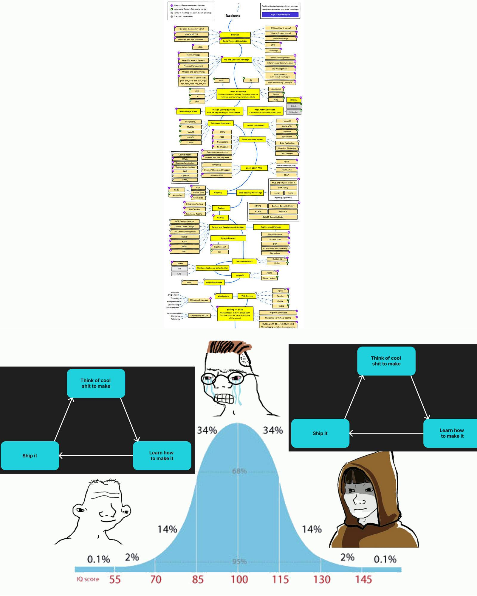

# Devs for Revolution

拥有我们的创世 NFT 将使您获得对社区的永久访问权，并暂时获得治理权（投票）。 在我们的新治理代币 $CODE 推出时，DAO 治理的投票将切换到这个新代币。 之后，我们的 Genesis NFT 将继续为您提供对 discord 服务器的完全访问权限和社区参与权，但没有投票权。

在区块 13612670（2021 年 11 月 14 日上午 07:41:06 +UTC）之前，创世 NFT 的持有者将有资格在我们的治理代币 $CODE 的初始空投期间申领，无论它是如何获得的。 在此区块之后获得 NFT 的任何人将没有资格获得初始空投，但将保持社区访问权限并有机会通过对公会和/或项目的贡献获得治理权。

