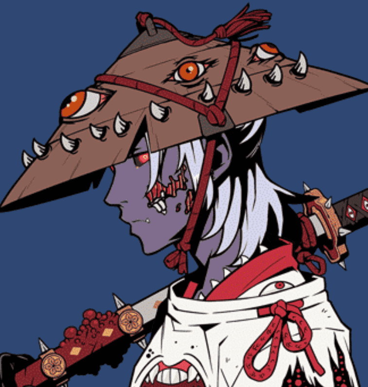

# DEZUKI

DEZUKI 转生了 8,888 名恶魔化的 Azukis 从冥界深处，准备反抗 metaverse 并在其上倾倒黑暗。不隶属于 Azuki。

出月背后

我是里奥。DEZUKI的创作者和艺术家。我出生在一个从事艺术界的家庭，这告诉我，每一个艺术笔触都装饰着一份感伤的宣言。AZUKI 把我从虚无中拉出来，渴望我内心的呼唤，在我的艺术表达中诚实。“弯曲的竹子比抵抗的橡树更坚固。” 生活就是为了你的热情而屈服。

因此，这个妖魔化版本的 Azuki 向该领域的先驱者致敬。来自黑社会，DEZUKI 渴望带来最好的 Azuki 衍生品，非常注重艺术品质和文化。由人民为人民创造。我希望我开始的东西会是一切，我开始的一切都会是一些东西。

